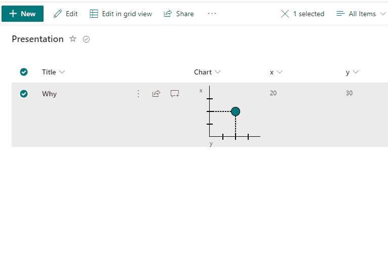

# One Point Chart

## Podsumowanie
Ta próbka pokazuje making one point chart with support of 2 numeric fields (x,y) with dialog description.

## Wymagania widoku

Format expect the following fields:
|Field                |Type
|-------------------|-------------
|Chart| Single line of text - Format (generic-one-point-chart.json) is added in this column        
|x|Number - x position
|y|Number - y position

## Przykład

Rozwiązanie|Autor(zy)
--------|---------
generic-one-point-chart.json | [André Lage](https://github.com/aaclage)

## Historia wersji

Wersja|Data|Uwagi
-------|----|--------
1.0|March 12, 2022|Wersja początkowa

## Zastrzeżenie
**TEN KOD JEST DOSTARCZANY W STANIE *TAKIM, W JAKIM JEST*, BEZ JAKIEJKOLWIEK GWARANCJI, WYRAŹNEJ ANI DOROZUMIANEJ, W TYM TAKŻE DOROZUMIANYCH GWARANCJI PRZYDATNOŚCI DO OKREŚLONEGO CELU, WARTOŚCI HANDLOWEJ ANI NIENARUSZANIA PRAW.**

---

## Dodatkowe uwagi

