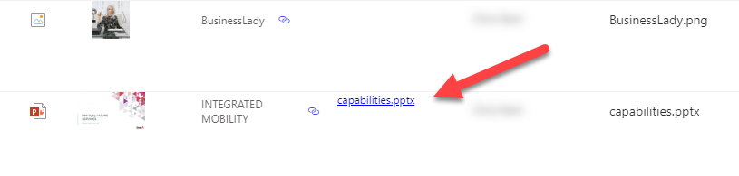

# Otwórz File as PDF

## Podsumowanie
Tę próbkę można zastosować do kolumny w bibliotece dokumentów, aby renderować link otwierający dokument Office jako PDF. Opiera się ona na interfejsie SharePoint 2.0 REST API. Symbol zastępczy `YOUR_DRIVE_ID` w JSON-ie należy zamienić na poprawny `driveurl` biblioteki dokumentów, w której używany jest ten format.

To Get the driveurl navigate to

https://--tenant--.sharepoint.com/sites/--sitename--/_api/v2.0/drives

replacing the --tenant-- and --sitename-- placeholders with approriate values.

Znajdź the entry where the "name" attribute is the Title of the library where you want to use this JSON. Select the coresponding `id` attribute and paste it into the JSON template, replacing `YOUR_DRIVE_ID` 

The id will look similar to `b!oqbo5Yz5ekialDrzcav5R3esotWm9VxCmi6bA63L7Wfuozp-JfhPTaVlFzxUdRwa`

## Wymagania widoku
Ten format można zastosować do any column type within a document library.

## Przykład

Rozwiązanie|Autor(zy)
--------|---------
generic-open-file-as-pdf.json | [Russell Gove](https://github.com/russgove)

## Historia wersji

Wersja|Data|Uwagi
-------|----|--------
1.0|28 października 2020|Wersja początkowa
1.1|7 lipca 2022|Dodano `@currentWeb` usage

## Zastrzeżenie
**TEN KOD JEST DOSTARCZANY W STANIE *TAKIM, W JAKIM JEST*, BEZ JAKIEJKOLWIEK GWARANCJI, WYRAŹNEJ ANI DOROZUMIANEJ, W TYM TAKŻE DOROZUMIANYCH GWARANCJI PRZYDATNOŚCI DO OKREŚLONEGO CELU, WARTOŚCI HANDLOWEJ ANI NIENARUSZANIA PRAW.**

---

## Dodatkowe uwagi

