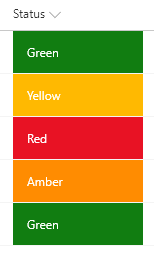
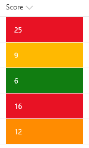
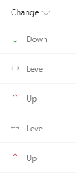
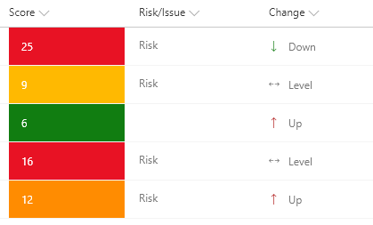

# Project Indicator Formats

## Podsumowanie

Three related formats for use in project management.

## Color-coded status (generic-project-management.json)

Text or choice column where the value is used to determine the color. This allows for an easy visualization of status. To use a lookup column instead, replace all occurences of `@currentField` with `@currentField.lookupValue`.

Ten format używa wartości Red, Yellow, Green i Amber, ale możesz go łatwo rozszerzyć, aby dopasować do własnego systemu kolorystycznego przez dodawanie lub usuwanie zagnieżdżonych warunków.

## Color-coded score ranges (risk-score.json)

A number column is evaluated against tiers of values to provide colors corresponding to score ranges. This format provides 4 ranges:

|Range|Color|
|---|---|
|value >= 16|Red|
|16 > value >= 12|OrangeLighter|
|12 > value >= 8|Yellow|
|value < 8|Green|

Możesz łatwo dostosować wartości i kolory, aby utworzyć własne zakresy. Możesz również dodawać lub usuwać zagnieżdżone warunki, aby zwiększyć lub zmniejszyć liczbę potrzebnych zakresów.

## Change direction indicator (risk-level-change-status.json)

A text or choice column where the value is represented as a colored icon. The color is provided using column formatting [predefined classes](https://docs.microsoft.com/en-us/sharepoint/dev/declarative-customization/column-formatting#predefined-classes) which are applied based on the text of the field. Similarly, [UI Fabric icons](https://developer.microsoft.com/en-us/fabric#/styles/icons) provide an additional visualization for the value. To use a lookup column instead, replace all occurences of `@currentField` with `@currentField.lookupValue`.

|Value|Class|Icon|
|---|---|---|
|Down|sp-field-trending--up|SortDown|
|Level||Split|
|Up|sp-field-trending--down|SortUp|

## Combined formats

Combining more than one of the above formats in a single listview can easily tranform your list into an intuitive and powerful dashboard.

## Wymagania widoku

### ryg-status.json
- This format should be applied to a text or choice field with values of Green, Yellow, Red, or Amber

### risk-score.json
- This format should be applied to a Liczba column

### risk-level-change-status.json
- This format should be applied to a text or choice field with values of Down, Level, or Up

## Przykład

Rozwiązanie|Autor(zy)
--------|---------
generic-project-management.json | [S Merchant](https://github.com/sohailmerchant)
risk-level-change-status.json | [S Merchant](https://github.com/sohailmerchant)
risk-score.json | [S Merchant](https://github.com/sohailmerchant)

## Historia wersji

Wersja|Data|Uwagi
-------|----|--------
1.0|10 listopada 2017|Wersja początkowa
1.1|22 marca 2018|Bug fixes and style adjustments
1.2|20 sierpnia 2018|Updated to use Excel-style expressions and theme color classes

## Zastrzeżenie
**TEN KOD JEST DOSTARCZANY W STANIE *TAKIM, W JAKIM JEST*, BEZ JAKIEJKOLWIEK GWARANCJI, WYRAŹNEJ ANI DOROZUMIANEJ, W TYM TAKŻE DOROZUMIANYCH GWARANCJI PRZYDATNOŚCI DO OKREŚLONEGO CELU, WARTOŚCI HANDLOWEJ ANI NIENARUSZANIA PRAW.**

---

## Dodatkowe uwagi

> Dodatkowe wersje wykorzystujące Abstract Tree Syntax (AST) są również dostępne dla środowisk, w których wyrażenia w stylu Excela nie są obsługiwane.

