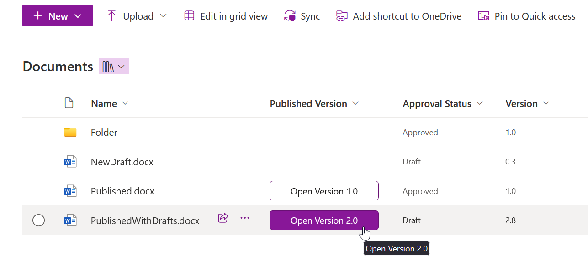

# Published Version

## Podsumowanie
Ta próbka tworzy a button for opening the currently published version of a document. Próbka is supposed to be used in a SharePoint Online document library with minor versions enabled. Button is displayed for every document with a published version, i.e., at version at least 1.0. It is linked to the latest published version of the document - for example, if the latest draft of the document is at version 2.8, the button opens version 2.0.

> [!NOTE]  
> The behavior of the button varies in different browsers and for different file types. For Office documents in **Microsoft Edge**, the button opens the file directly from SharePoint in the installed app. In other browsers, the button usually downloads the document, optionally opening it after download, based on settings.

## Wymagania widoku
- Ten format można zastosować do any column type

## Przykład

Rozwiązanie|Autor(zy)
--------|---------
generic-published-version.json | [Miroslav Kačena](https://github.com/mkacena) ([@MiroslavKacena](https://x.com/MiroslavKacena))

## Historia wersji

Wersja|Data|Uwagi
-------|----|--------
1.0|7 października 2024|Wersja początkowa

## Zastrzeżenie

**TEN KOD JEST DOSTARCZANY W STANIE *TAKIM, W JAKIM JEST*, BEZ JAKIEJKOLWIEK GWARANCJI, WYRAŹNEJ ANI DOROZUMIANEJ, W TYM TAKŻE DOROZUMIANYCH GWARANCJI PRZYDATNOŚCI DO OKREŚLONEGO CELU, WARTOŚCI HANDLOWEJ ANI NIENARUSZANIA PRAW.**

---

## Dodatkowe uwagi

Brak

