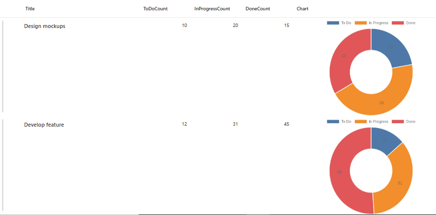
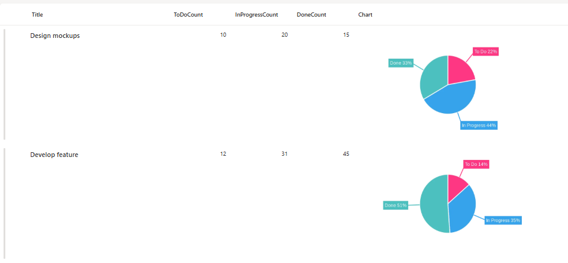
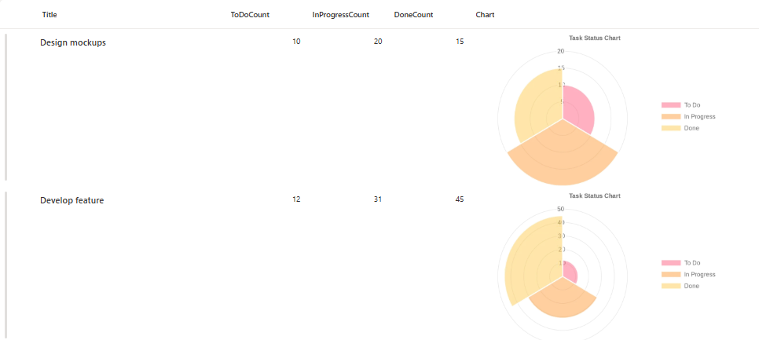

# Task Status Chart Column Formatters

## Podsumowanie

This collection provides **three different chart visualizations** for task status data in SharePoint lists using column formatting. Each formatter automatically generates dynamic charts showing the distribution of tasks across "To Do", "In Progress", and "Done" states.

## Available Chart Types

Ta próbka zawiera three chart variations:

1. **doughnut Chart** (`generic-quick-charts-io.json`) - Classic doughnut with automatic colors
2. **Outlabeled Pie Chart** (`generic-quick-charts-outlabeledPie.json`) - Enhanced pie chart with labels outside segments
3. **Polar Area Chart** (`generic-quick-charts-polararea.json`) - Polar area chart with legend and title

## Wymagania widoku

Utwórz listę z następującymi kolumnami:

| Nazwa wewnętrzna | Typ    |
|---------------------|---------|
| **Title**       | Pojedyncza linia tekstu  |
| **ToDoCount**       | Liczba  |
| **InProgressCount** | Liczba  |
| **DoneCount**       | Liczba  |
| **Charts**       | Pojedyncza linia tekstu  |

*Uwaga: dodatkowe kolumny można dodać w zależności od potrzeb konkretnego przypadku użycia.*

## Dane przykładowe

| ToDoCount | InProgressCount | DoneCount |
|-----------|----------------|-----------|
| 5         | 3              | 12        |
| 8         | 2              | 5         |
| 0         | 4              | 16        |

## Chart Variations

### 1. Doughnut Chart
- Clean, simple doughnut chart visualization
- Automatic color assignment by QuickChart.io
- Ideal for basic status visualization
- File: `generic-quick-charts-doughnut.json`

### 2. Outlabeled Pie Chart
- Labels positioned outside pie segments
- Custom colors: Red (#FF3784), Blue (#36A2EB), Teal (#4BC0C0)
- Displays label name and percentage ("%l %p")
- Responsive font sizing (12-18px)
- File: `generic-quick-charts-pie-outlabeled.json`

### 3. Polar Area Chart
- Polar area visualization with semi-transparent segments
- Right-positioned legend
- Chart title: "Task Status Chart"
- Custom RGBA colors with 50% opacity
- File: `generic-quick-charts-polararea.json`

## Jak to działa

- Formatter displays a **doughnut chart** for each list item based on task status counts
- Wykresy są generowane dynamicznie przy użyciu [QuickChart.io API](https://quickchart.io/)
- Each doughnut chart visualizes three data segments:
  - **To Do** (first segment)
  - **In Progress** (second segment)
  - **Done** (third segment)
- Układ wyświetla wykresy w rozmiarze 400x250 pikseli z zaokrąglonymi rogami
- Wykres aktualizuje się automatycznie po zmianie wartości w kolumnach

## Konfiguracja zabezpieczeń

**KRYTYCZNE**: zanim wykresy zaczną się wyświetlać, musisz skonfigurować ustawienia zabezpieczeń SharePoint:

1. Navigate to **SharePoint Site**
2. Przejdź do **Site Settings**
3. Znajdź **"HTML Field Security"** section
4. Dodaj `quickchart.io` do listy **dozwolonych domen**
5. Zapisz konfigurację

**Bez tej konfiguracji zabezpieczeń wykresy nie będą wyświetlane z powodu zasad bezpieczeństwa zawartości w SharePoint.**

## Przykład

Rozwiązanie|Autor(zy)
--------|---------
generic-quick-charts-io.json | [Sai Bandaru](https://github.com/saiiiiiii)
generic-quick-charts-outlabeledPie.json | [Sai Bandaru](https://github.com/saiiiiiii)
generic-quick-charts-polararea.json | [Sai Bandaru](https://github.com/saiiiiiii)

## Historia wersji

Wersja|Data|Uwagi
-------|----|--------
1.0|13 października 2025|Wersja początkowa

## Zastrzeżenie
**TEN KOD JEST DOSTARCZANY W STANIE *TAKIM, W JAKIM JEST*, BEZ JAKIEJKOLWIEK GWARANCJI, WYRAŹNEJ ANI DOROZUMIANEJ, W TYM TAKŻE DOROZUMIANYCH GWARANCJI PRZYDATNOŚCI DO OKREŚLONEGO CELU, WARTOŚCI HANDLOWEJ ANI NIENARUSZANIA PRAW.**

## Limitations
- Wymaga połączenia z internetem do generowania wykresów
- External dependency on QuickChart.io API availability
- Wydajność może się różnić przy dużych listach ze względu na wiele wywołań API
- Maximum URL length restrictions may apply for complex configurations
- Charts may take a moment to render on initial page load

## Advanced Customization

Możesz dostosować the charts by modifying the URL-encoded Chart.js configuration:

- **Colors**: Modify `backgroundColor` arrays with hex or rgba values
- **Labels**: Change text in the `labels` array
- **Legend Position**: Adjust `legend.position` (top, bottom, left, right)
- **Chart Size**: Modify the `width` and `height` in the `style` section
- **Fonts**: Customize font sizes and families in chart options
- **Animations**: Add animation configurations to the options object

Refer to the [QuickChart.io documentation](https://quickchart.io/documentation/) and [Chart.js documentation](https://www.chartjs.org/docs/) for all available customization options.

## Rozwiązywanie problemów

**Charts not displaying:**
- Verify `quickchart.io` is added to HTML Field Security settings
- Check that column internal names match exactly (case-sensitive)
- Ensure numeric columns contain valid numbers (not text)
- Clear browser cache and refresh the page

**Charts showing incorrect data:**
- Verify the column internal names in your JSON match your list columns
- Check that you're applying the formatter to the correct column
- Ensure numeric values are not null or empty

## Performance Tips

- For large lists (500+ items), consider using view filters to limit rendered items
- Use indexed columns for better filtering performance
- Consider caching strategies for frequently accessed lists
- Monitor QuickChart.io API usage and rate limits

## Licencja
To rozwiązanie formatowania jest udostępniane w stanie takim, w jakim jest, do celów edukacyjnych i profesjonalnych. Interfejs QuickChart.io API ma własne warunki korzystania i limity użycia. Przed użyciem produkcyjnym zapoznaj się z ich dokumentacją.

## Resources
- [SharePoint Column Formatting Documentation](https://docs.microsoft.com/en-us/sharepoint/dev/declarative-customization/column-formatting)
- [QuickChart.io Documentation](https://quickchart.io/documentation/)
- [Chart.js Documentation](https://www.chartjs.org/docs/)
- [JSON Schema for SharePoint](https://developer.microsoft.com/json-schemas/sp/v2/column-formatting.schema.json)

