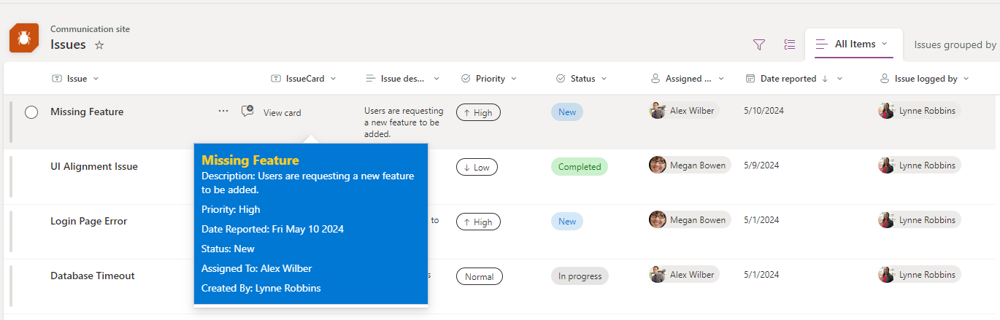

# Quick-View Issue Card

## Podsumowanie

The Issue HoverCard Formatter is a SharePoint list Column JSON formatter component tailored to enhance user experience when interacting with issue data. It provides a streamlined approach to view essential information about issues through hover cards, offering quick insights in a card format.

## Wymagania widoku

| Column Name         | Type                                   | Internal Column Name |
| ------------------- | -------------------------------------- | -------------------- |
| Title               | Single Line Text                       | Title                |
| Issue Description   | Multiple Lines of Text                 | Description          |
| Priority            | Choice (Critical, High, Normal, Low)   | Priority             |
| Status              | Choice (Blocked, In Progress, Completed, Duplicate)     | Status  |
| Assigned to         | Person or Group                        | Assignedto0          |
| Date Reported       | Date and Time                          | DateReported         |
| Issue logged by     | Person or Group                        | Issueloggedby        |
| IssueCard           | Single Line Text                       | IssueCard            |

## Przykład

Rozwiązanie|Autor(zy)
--------|---------
generic-quickview-issue-card.json | [Jatin Patil](https://github.com/Jatin-patil)

## Historia wersji

| Version | Date             | Comments        |
| ------- | ---------------- | --------------- |
| 1.0     | 29 May, 2024     | Wersja początkowa |

## Zastrzeżenie

**THIS CODE IS PROVIDED _AS IS_ WITHOUT WARRANTY OF ANY KIND, EITHER EXPRESS OR IMPLIED, INCLUDING ANY IMPLIED WARRANTIES OF FITNESS FOR A PARTICULAR PURPOSE, MERCHANTABILITY, OR NON-INFRINGEMENT.**

