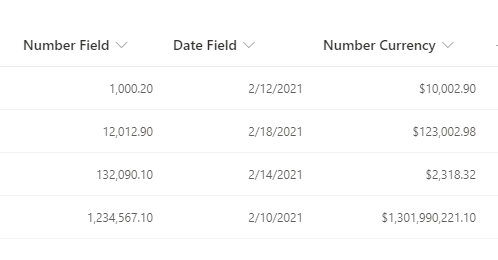

# Right-Aligned Content

## Podsumowanie
Ta próbka pokazuje how to right-align your content, while preserving the number or date format set using the SharePoint / Lists UI.  Numbers and dates should typically be presented as right-aligned, for improved readability.

Most existing json formatting samples or examples for this requirement (blog, forum posts, etc.) lose the number or date format, making them impractical to use as the result is hard to read. Some examples try to remedy this with complex string manipulation to reformat the values, which can be fragile. With the recent addition of `.displayValue` none of that is necessary!

Simply set the desired formatting using the SharePoint / Lists UI, and this sample will honor those settings while aligning them to the right.

## Wymagania widoku
- Ten format można zastosować do any column type. It is best suited to numeric/currency or date columns.

## Przykład

Rozwiązanie|Autor(zy)
--------|---------
generic-right-align.json | [Mike Honey](https://github.com/Mike-Honey)

## Historia wersji

Wersja|Data|Uwagi
-------|----|--------
1.0|February 13, 2021|Wersja początkowa

## Zastrzeżenie
**TEN KOD JEST DOSTARCZANY W STANIE *TAKIM, W JAKIM JEST*, BEZ JAKIEJKOLWIEK GWARANCJI, WYRAŹNEJ ANI DOROZUMIANEJ, W TYM TAKŻE DOROZUMIANYCH GWARANCJI PRZYDATNOŚCI DO OKREŚLONEGO CELU, WARTOŚCI HANDLOWEJ ANI NIENARUSZANIA PRAW.**

---

## Dodatkowe uwagi
None

