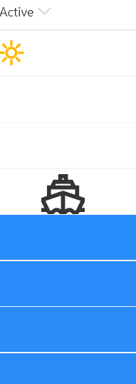

# Row Index Drawing

## Podsumowanie
This is a silly format that draws a picture in your view using the `@rowIndex` token to adjust the colors and to determine when certain pictures (icons or SVG elements) should show up.

Also included is the AquaticAssetsGenerator.ps1 PowerShell script that demonstrates creating lots of random entries in a list. You'll want at least 201 items to show the full picture.

## Wymagania widoku
- Ten format można zastosować do any view

## Przykład

Rozwiązanie|Autor(zy)
--------|---------
generic-rowIndex-drawing.json | [Chris Kent](https://github.com/thechriskent)

## Historia wersji

Wersja|Data|Uwagi
-------|----|--------
1.0|February 20, 2020|Wersja początkowa

## Zastrzeżenie
**TEN KOD JEST DOSTARCZANY W STANIE *TAKIM, W JAKIM JEST*, BEZ JAKIEJKOLWIEK GWARANCJI, WYRAŹNEJ ANI DOROZUMIANEJ, W TYM TAKŻE DOROZUMIANYCH GWARANCJI PRZYDATNOŚCI DO OKREŚLONEGO CELU, WARTOŚCI HANDLOWEJ ANI NIENARUSZANIA PRAW.**

---

## Dodatkowe uwagi

- [Użyj formatowania kolumn do dostosowania SharePoint](https://docs.microsoft.com/en-us/sharepoint/dev/declarative-customization/column-formatting#me)

