# Akcje wiersza

## Podsumowanie
Możesz używać formatowania kolumn i widoków do tworzenia przycisków wykonujących predefiniowane akcje po kliknięciu. Ta próbka zawiera kilka szybkich formatów pokazujących użycie każdej z dostępnych akcji.

Wszystkie te przykłady zostały przygotowane dla formatowania kolumn, ale można je łatwo dostosować do formatowania widoków.

Niestandardowe akcje wiersza działają tylko wtedy, gdy są umieszczone wewnątrz elementów `button`, `div` lub `span`. Możesz jednak dowolnie zmieniać style i elementy podrzędne, aby całkowicie dostosować wygląd _(możesz nawet opakować cały format w przycisk - przykład znajdziesz w [bulletin-board-format](../../view-samples/bulletin-board-format))_.

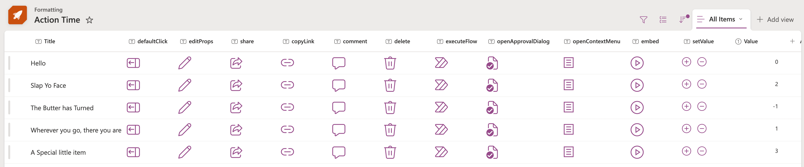

> Akcje są obsługiwane na listach i w bibliotekach w SharePoint oraz Microsoft Lists

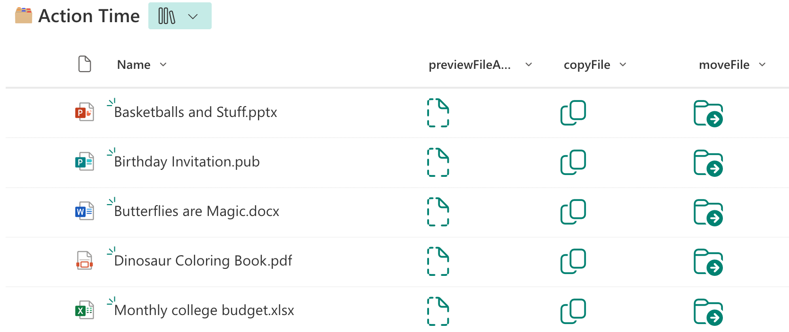

> Niektóre akcje są jednak obsługiwane tylko w bibliotekach dokumentów

### defaultClick (generic-rowactions.json)
Ta akcja otwiera element listy. To odpowiednik dwukrotnego kliknięcia elementu.

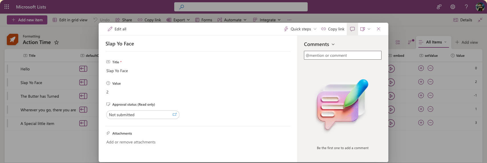

### editProps (editProps.json)
Ta akcja otwiera element listy w trybie edycji. To odpowiednik dwukrotnego kliknięcia elementu i wybrania `Edit all`.

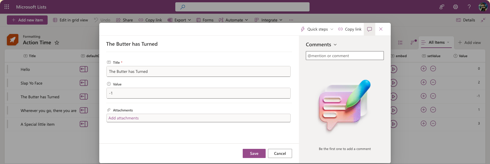

### share (share.json)
Ta akcja otwiera okno dialogowe udostępniania dla elementu. To odpowiednik zaznaczenia elementu i kliknięcia przycisku `Share` na pasku poleceń.

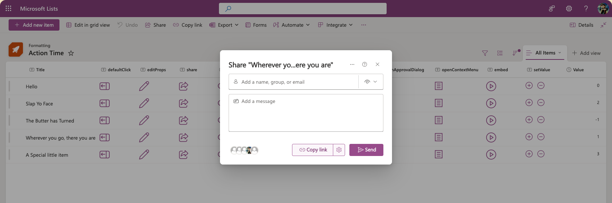

### copyLink (copyLink.json)
Ta akcja otwiera okno dialogowe kopiowania linku dla elementu i kopiuje link do schowka. To odpowiednik zaznaczenia elementu i kliknięcia przycisku `Copy link` na pasku poleceń.

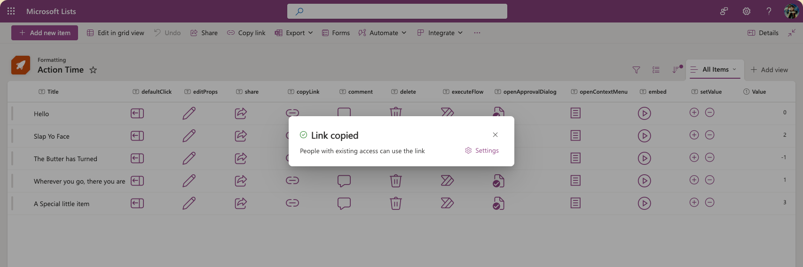

### comment (comment.json)
Ta akcja otwiera element listy i ustawia fokus w polu komentarza. To odpowiednik dwukrotnego kliknięcia elementu, a następnie kliknięcia w pole komentarza.

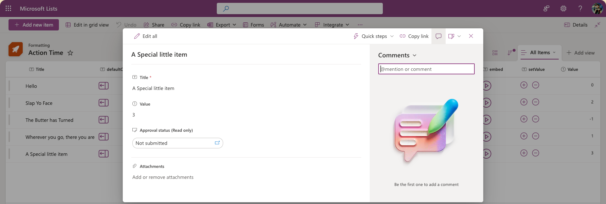

### delete (delete.json)
Ta akcja wyświetla użytkownikowi okno potwierdzenia usunięcia i usuwa element po wybraniu opcji potwierdzającej. To odpowiednik zaznaczenia elementu i kliknięcia przycisku `Delete` na pasku poleceń.

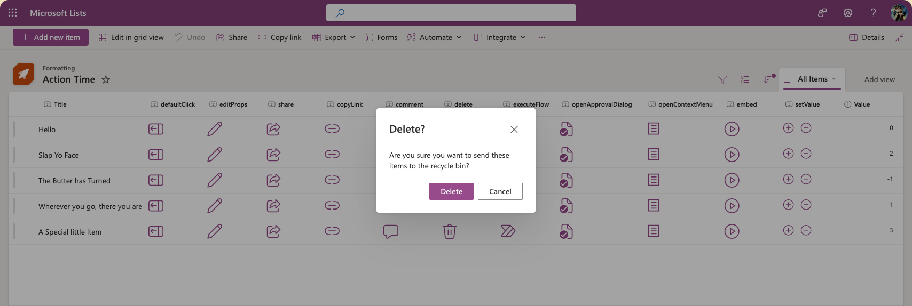

### executeFlow (executeFlow.json)
Ta akcja uruchamia przepływ Power Automate dla wybranego elementu. Wymaga dodatkowej konfiguracji poprzez właściwość `actionParams`. Identyfikator jest zawsze wymagany, ale opcjonalnie możesz także podać właściwości `headerText` i/lub `runFlowButtonText`, aby dostosować panel przepływu.

>Uwaga: parametry `headerText` i `runFlowButtonText` nie są dostępne w SharePoint 2019

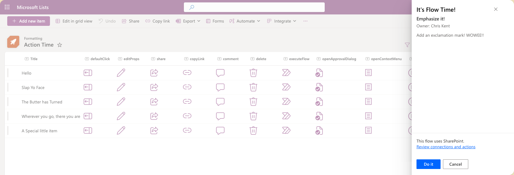

#### Aby uzyskać identyfikator przepływu:

1. Kliknij _Flow_ > _See your flows_ na liście SharePoint, na której skonfigurowano przepływ
2. Kliknij przepływ, który chcesz uruchomić
3. Skopiuj identyfikator z końca adresu URL

> Alternatywnie tę informację znajdziesz w środowisku Power Automate, w szczegółach przepływu

#### actionParams

`actionParams` to wartości JSON, ale ponieważ znajdują się wewnątrz formatu JSON, muszą zostać zapisane jako tekstowy ciąg JSON. Aby to zrobić, trzeba poprzedzić wszystkie podwójne cudzysłowy znakami ucieczki. JSON dla `actionParams` może więc wyglądać tak:

```JSON
{
  "id": "f7ecec0b-15c5-419f-8211-302a5d4e94f1",
  "headerText": "It's Flow Time!",
  "runFlowButtonText": "Do it"
}
```

Trzeba to umieścić w jednej wartości tekstowej właściwości `actionParams`, więc przed każdym podwójnym cudzysłowem (`"`) dodajemy ukośnik odwrotny (`\`) i zapisujemy wszystko w jednym wierszu:

```JSON
"actionParams": "{\"id\":\"f7ecec0b-15c5-419f-8211-302a5d4e94f1\", \"headerText\":\"It's Flow Time!\",\"runFlowButtonText\":\"Do it\"}"
```

Tę wartość można zapisać także za pomocą wyrażeń, ale trzeba pamiętać o dodaniu wszystkich znaków ucieczki.

```JSON
"actionParams": "='{\"id\":\"' + if([$Status] == 'New', 'f7ecec0b-15c5-419f-8211-302a5d4e94f1', 'b8rcwc6d-26d3-562n-5657-201b5a2c32d0') + '\"}'"
```

### openApprovalDialog (openApprovalDialog.json)
Ta akcja otwiera okno zatwierdzania dla elementu, niezależnie od etapu akceptacji. Wymaga włączenia zatwierdzania zawartości dla listy lub biblioteki. To odpowiednik zaznaczenia elementu i kliknięcia przycisku `Request Approval` na pasku poleceń.

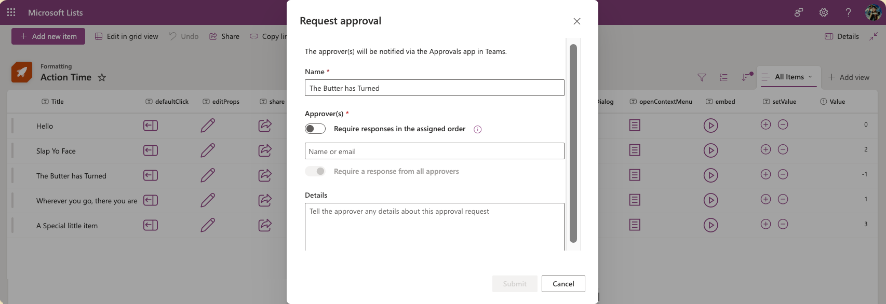

### openContextMenu (openContextMenu.json)
Ta akcja otwiera menu kontekstowe elementu. To odpowiednik kliknięcia prawym przyciskiem myszy (lub kliknięcia z klawiszem <kbd>CTRL</kbd> na Macu) na elemencie.

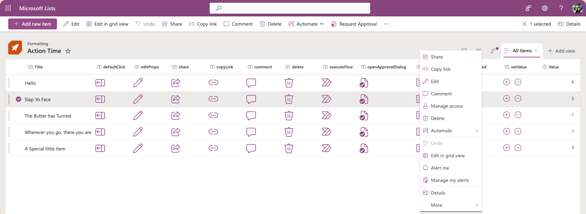

### embed (embed.json)
Ta akcja otwiera dymek z osadzoną zawartością. Aby określić, jaka treść ma zostać załadowana, musisz podać wartość `src` jako część `actionInput`. Możesz również określić szerokość i wysokość dymku za pomocą opcjonalnych właściwości.

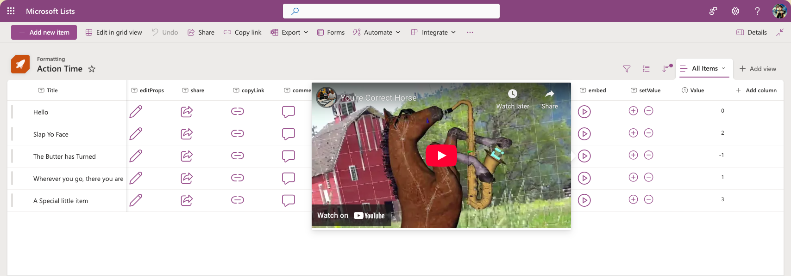

#### actionInput
W `actionInput` można ustawić 3 właściwości, z czego `src` jest wymagane.

- `src`: adres URL treści, którą można osadzić i załadować w dymku (przez iframe)
- `width`: opcjonalna właściwość określająca szerokość dymku w pikselach. Wpisz wartość jako zwykłą liczbę.
- `height`: opcjonalna właściwość określająca wysokość dymku w pikselach. Wpisz wartość jako zwykłą liczbę.

#### Jak uzyskać adres URL do osadzenia
Właściwość `src` to adres URL treści możliwej do osadzenia. Zwykle znajdziesz go jako atrybut `src` wygenerowanego elementu `iframe` w serwisie, który oferuje opcję `embed`.

> Uwaga: SharePoint ogranicza domeny, których można do tego używać. Można to dostosować dla poszczególnych kolekcji witryn lub dla całej dzierżawy. [Zezwalanie na osadzanie treści w SharePoint Lists przy użyciu niestandardowych formaterów lub ograniczanie tej możliwości](https://go.microsoft.com/fwlink/p/?linkid=2258033)

Na przykład możesz uzyskać adres URL do osadzenia publicznego filmu z YouTube, klikając **Share**, następnie wybierając **Embed** i kopiując wartość `src` oraz wartości `width` i `height` z wygenerowanego kodu:

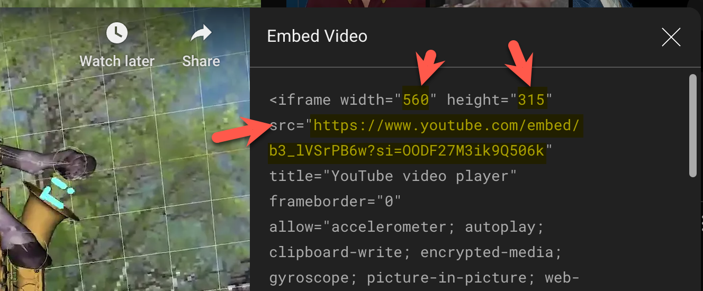

### setValue (setValue.json)
Ta akcja pozwala zaktualizować wartości jednego lub wielu pól dla danego elementu. Pola i ich nowe wartości określasz za pomocą `actionInput`.

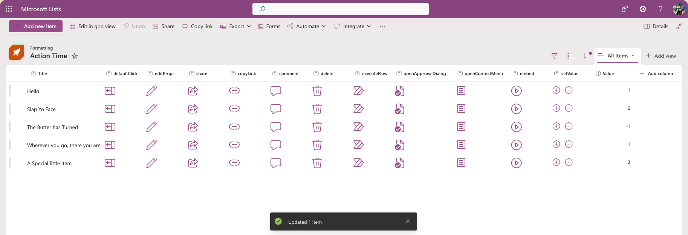

### previewFileAction (previewFileAction.json)
Ta akcja otwiera domyślny podgląd pliku bezpośrednio w interfejsie biblioteki.

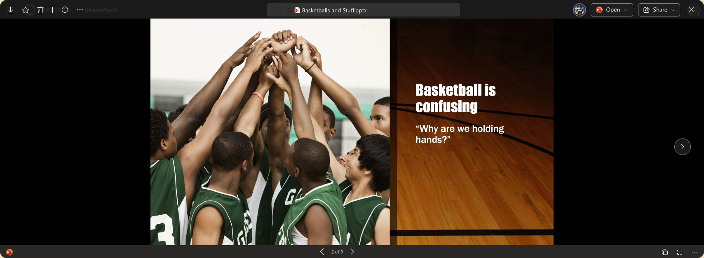

### copyFile (copyFile.json)
Ta akcja wysyła kopię pliku do innej biblioteki. Bibliotekę docelową i/lub podfolder określasz za pomocą `actionParams`. To odpowiednik zaznaczenia pliku i kliknięcia przycisku `Copy to` na pasku poleceń, z dodatkową korzyścią w postaci wcześniejszego wskazania miejsca docelowego.

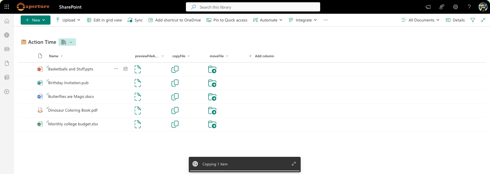

#### actionParams
Podobnie jak w `executeFlow`, `actionParams` to JSON ze znakami ucieczki, ale obecnie trzeba podać tylko jedną właściwość: `destinationUrl`. Jest to pełny adres URL (z użyciem `@currentWeb`, aby uniknąć wpisywania na stałe adresu dzierżawy) prowadzący bezpośrednio do biblioteki i/lub folderu, do którego chcesz skopiować plik.

Uprawnienia użytkownika do biblioteki lub folderu docelowego nie są sprawdzane z wyprzedzeniem, więc użytkownicy bez odpowiednich uprawnień otrzymają błąd.

### moveFile (moveFile.json)
Ta akcja przenosi plik do innej biblioteki, usuwając go z biblioteki źródłowej. Bibliotekę docelową i/lub podfolder określasz za pomocą `actionParams`. To odpowiednik zaznaczenia pliku i kliknięcia przycisku `Move to` na pasku poleceń, z dodatkową korzyścią w postaci wcześniejszego wskazania miejsca docelowego.

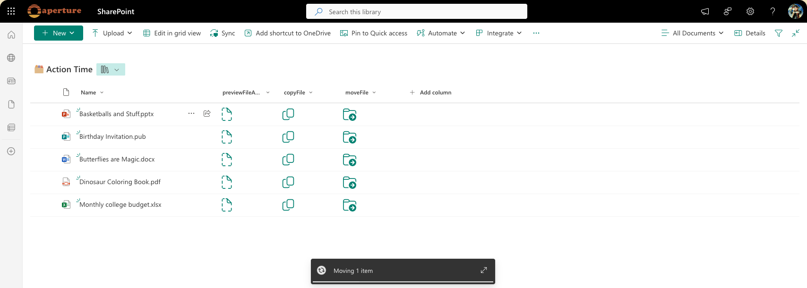

#### actionParams
Podobnie jak w `executeFlow`, `actionParams` to JSON ze znakami ucieczki, ale obecnie trzeba podać tylko jedną właściwość: `destinationUrl`. Jest to pełny adres URL (z użyciem `@currentWeb`, aby uniknąć wpisywania na stałe adresu dzierżawy) prowadzący bezpośrednio do biblioteki i/lub folderu, do którego chcesz przenieść plik.

Uprawnienia użytkownika do biblioteki lub folderu docelowego nie są sprawdzane z wyprzedzeniem, więc użytkownicy bez odpowiednich uprawnień otrzymają błąd.

## Wymagania widoku
- Te formaty można zastosować do dowolnego typu kolumny, ponieważ jej wartość jest ignorowana
- Jeśli używasz akcji `executeFlow`, lista lub biblioteka musi mieć powiązany przepływ, a jego identyfikator należy umieścić w `actionParams` przycisku
- Przykład `setValue.json` zakłada istnienie kolumny liczbowej o nazwie `Value`
- Formaty `previewFileAction.json`, `copyFile.json` i `moveFile.json` mogą być używane wyłącznie w bibliotekach dokumentów

> Wskazówka: możesz zastosować te formaty do kolumny obliczeniowej z formułą `=""`. Dzięki temu od razu widać, że pola nie mają przechowywać wartości, a kolumny można łatwo ukryć w formularzu.

## Przykład

Rozwiązanie|Autor(zy)
--------|---------
generic-rowactions.json | [Chris Kent](https://github.com/thechriskent)
editProps.json | [Chris Kent](https://github.com/thechriskent)
share.json | [Chris Kent](https://github.com/thechriskent)
copyLink.json | [Chris Kent](https://github.com/thechriskent)
comment.json | [Chris Kent](https://github.com/thechriskent)
delete.json | [Chris Kent](https://github.com/thechriskent)
executeFlow.json | [Chris Kent](https://github.com/thechriskent)
openApprovalDialog.json | [Chris Kent](https://github.com/thechriskent)
openContextMenu.json | [Chris Kent](https://github.com/thechriskent)
embed.json | [Chris Kent](https://github.com/thechriskent)
setValue.json | [Chris Kent](https://github.com/thechriskent)
previewFileAction.json | [Chris Kent](https://github.com/thechriskent)
copyFile.json | [Chris Kent](https://github.com/thechriskent)
moveFile.json | [Chris Kent](https://github.com/thechriskent)

## Historia wersji

Wersja|Data|Uwagi
-------|----|--------
1.0|18 kwietnia 2019|Wersja początkowa
2.0|31 lipca 2025|Dodatkowe akcje

## Zastrzeżenie
**TEN KOD JEST DOSTARCZANY W STANIE *TAKIM, W JAKIM JEST*, BEZ JAKIEJKOLWIEK GWARANCJI, WYRAŹNEJ ANI DOROZUMIANEJ, W TYM TAKŻE DOROZUMIANYCH GWARANCJI PRZYDATNOŚCI DO OKREŚLONEGO CELU, WARTOŚCI HANDLOWEJ ANI NIENARUSZANIA PRAW.**

---

## Dodatkowe uwagi

- Dodatkowe przykłady akcji `executeFlow` znajdziesz tutaj:
  - [generic-start-flow](../generic-start-flow)
  - [generic-start-flow-conditionally](../generic-start-flow-conditionally)


