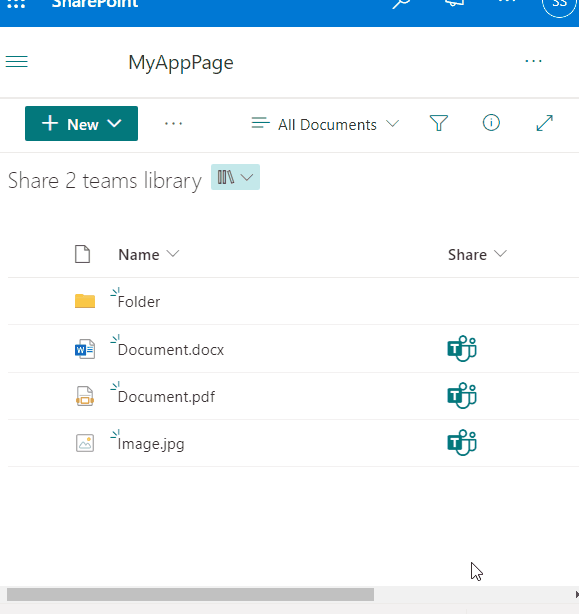

# Udostępnij w Teams

## Podsumowanie
Ta próbka pokazuje how to add a "Share to Microsoft Teams" link into a document library.
A new tab is opened once a user clicks the "Teams" icon, then the user will be asked in which team and channel to post the document.

## Wymagania widoku

Format can be applied to any column, although it is recommended to add it to a calculated column with a `="1"` formula

## Przykład

Rozwiązanie|Autor(zy)
--------|---------
generic-share-to-teams.json | [Sven Sieverding](https://github.com/365knoten)

## Historia wersji

Wersja|Data|Uwagi
-------|----|--------
1.0|15 sierpnia 2023|Wersja początkowa

## Zastrzeżenie
**TEN KOD JEST DOSTARCZANY W STANIE *TAKIM, W JAKIM JEST*, BEZ JAKIEJKOLWIEK GWARANCJI, WYRAŹNEJ ANI DOROZUMIANEJ, W TYM TAKŻE DOROZUMIANYCH GWARANCJI PRZYDATNOŚCI DO OKREŚLONEGO CELU, WARTOŚCI HANDLOWEJ ANI NIENARUSZANIA PRAW.**

