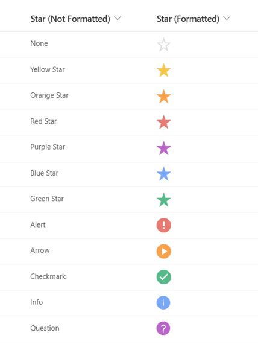
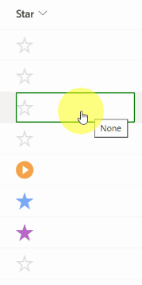

# Star Icons

## Podsumowanie
Ta próbka formatuje kolumnę wyboru tak, aby używać ikon gwiazdek podobnych do Gmaila.

Ta próbka wymaga a choice field with these options added:

- Brak
- Yellow Star
- Orange Star
- Red Star
- Purple Star
- Blue Star
- Green Star
- Alert
- Arrow
- Checkmark
- Info
- Question

Also, it uses `inlineEditField`, which allows the user to change the icon on the view.

## Wymagania widoku
- Ten format można zastosować do a Choice column

## Przykład

Rozwiązanie|Autor(zy)
--------|---------
generic-star-icon.json | [Will Cooper](https://github.com/wwcoop)

## Historia wersji

Wersja|Data|Uwagi
-------|----|--------
1.0|15 maja 2023|Wersja początkowa

## Zastrzeżenie
**TEN KOD JEST DOSTARCZANY W STANIE *TAKIM, W JAKIM JEST*, BEZ JAKIEJKOLWIEK GWARANCJI, WYRAŹNEJ ANI DOROZUMIANEJ, W TYM TAKŻE DOROZUMIANYCH GWARANCJI PRZYDATNOŚCI DO OKREŚLONEGO CELU, WARTOŚCI HANDLOWEJ ANI NIENARUSZANIA PRAW.**

