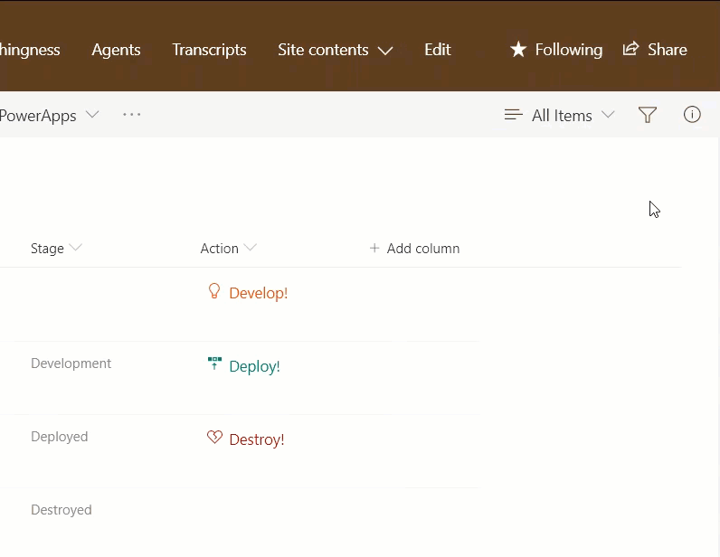
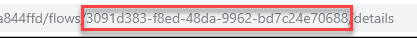

# Conditionally Launch Flow for Item

## Podsumowanie
Możesz użyć formatowania kolumn, aby create buttons that, when clicked, run Flows on the corresponding list item. The Flow Launch Panel will be displayed after clicking the button allowing the user to specify any required data and then run the flow. This is demonstrated in the [Generic-Start-Flow](../generic-start-flow) sample.

Ta próbka pokazuje how to take it further to conditionally change which flow is launched or if a flow button option should be shown at all.

Column Formatting allows you to use expressions for individual attributes. This provides us a lot of power, but doesn't always make it obvious when we want to make multiple changes based on the same expression or conditionally include/exclude elements.

Ta próbka dostosowuje the color, icon, text, visibility, and the flow launched based on another column in the view, `Stage`. The same basic expression (nested if operations) is used for each of the properties individually. Here's a table showing the conditional results:

|Stage|Class|Icon|Text|Visible|Flow|
|---|---|---|---|---|---|
|_blank_|ms-fontColor-orangeLight|Lightbulb|Develop!|Yes|b60a26d3-fd87-4947-9d1d-344cb31d953a|
|Development|ms-fontColor-teal|Deploy|Deploy!|Yes|3a27a39c-0ec9-4342-8fe3-bfb37fefc3da|
|Deployed|ms-fontColor-redDark|HeartBroken|Destroy!|Yes|3091d383-f8ed-48da-9962-bd7c24e70688|
|Destroyed|ms-fontColor-redDark|HeartBroken|Destroy!|**No**|3091d383-f8ed-48da-9962-bd7c24e70688|

Notice that "Destroyed" condition has values for class, icon, text, etc. but it doesn't matter because the `display` gets set to `none`.

### Flow IDs

To use the sample, you must substitute the ID of the Flow(s) you want to run. The IDs are contained within the expression inside the `customRowAction` attribute inside the `button` element.

Aby uzyskać identyfikator przepływu:

1. Kliknij _Flow_ > _See your flows_ na liście SharePoint, na której skonfigurowano przepływ
2. Kliknij przepływ, który chcesz uruchomić
3. Skopiuj identyfikator z końca adresu URL (between _flows/_ and _/details_)

## Wymagania widoku
- Ten format można zastosować do any column type (its value is ignored)
- This sample isn't really intended to be used directly since it's very specific, but if you want to do it exactly:
  - The list is expected to have 3 associated Flows, the IDs need to be included in the `actionParams` expression for the button
  - Format expects a Choice Column called `Stage` with the following values
    - Development
	- Deployed
	- Destroyed

> Wskazówka: możesz zastosować ten format do kolumny obliczeniowej z formułą `=""`. Dzięki temu pole nie będzie częścią formularzy nowego elementu ani edycji.

## Przykład

Rozwiązanie|Autor(zy)
--------|---------
generic-start-flow-conditionally.json | [Chris Kent](https://github.com/thechriskent)

## Historia wersji

Wersja|Data|Uwagi
-------|----|--------
1.0|15 marca 2019|Initial version

## Zastrzeżenie
**TEN KOD JEST DOSTARCZANY W STANIE *TAKIM, W JAKIM JEST*, BEZ JAKIEJKOLWIEK GWARANCJI, WYRAŹNEJ ANI DOROZUMIANEJ, W TYM TAKŻE DOROZUMIANYCH GWARANCJI PRZYDATNOŚCI DO OKREŚLONEGO CELU, WARTOŚCI HANDLOWEJ ANI NIENARUSZANIA PRAW.**

---

## Dodatkowe uwagi

- [Użyj formatowania kolumn do dostosowania SharePoint](https://docs.microsoft.com/en-us/sharepoint/dev/declarative-customization/column-formatting)

