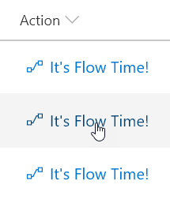

# Launch a Flow for a Selected Item

## Podsumowanie
Możesz użyć formatowania kolumn, aby create buttons that, when clicked, run Flows on the corresponding list item. The Flow Launch Panel will be displayed after clicking the button allowing the user to specify any required data and then run the flow.

To use the sample, you must substitute the ID of the Flow you want to run. This ID is contained within the `customRowAction` attribute inside the `button` element.

To obtain a Flow's ID:

1. Click _Flow_ > _See your flows_ in the SharePoint list where the Flow is configured
2. Click on the Flow you want to run
3. Copy the ID from the end of the URL

## Wymagania widoku
- Ten format można zastosować do any column type (its value is ignored)
- The list is expected to have an associated Flow, the ID of this flow needs to be included in the `actionParams` for the button

> Tip - You can apply this format to a Calculated Column with a formula of `=""`. This prevents this field from being part of your edit/new forms.

## Przykład

Rozwiązanie|Autor(zy)
--------|---------
generic-start-flow.json | [Yannick Borghmans](https://github.com/yborghmans)

## Historia wersji

Wersja|Data|Uwagi
-------|----|--------
1.0|November 25, 2017|Wersja początkowa
1.1|January 22, 2018|Adjusted actionParams markup
1.2|August 18, 2018|Icon is now included in button and theme colors are used

## Zastrzeżenie
**TEN KOD JEST DOSTARCZANY W STANIE *TAKIM, W JAKIM JEST*, BEZ JAKIEJKOLWIEK GWARANCJI, WYRAŹNEJ ANI DOROZUMIANEJ, W TYM TAKŻE DOROZUMIANYCH GWARANCJI PRZYDATNOŚCI DO OKREŚLONEGO CELU, WARTOŚCI HANDLOWEJ ANI NIENARUSZANIA PRAW.**

---

## Dodatkowe uwagi
Ta próbka jest również opisana w głównej dokumentacji dotyczącej formatowania kolumn

A similar wizard is also included in the [Column Formatter](https://github.com/SharePoint/sp-dev-solutions/blob/master/solutions/ColumnFormatter/README.md) webpart that allows full customization.

- [Użyj formatowania kolumn do dostosowania SharePoint](https://docs.microsoft.com/en-us/sharepoint/dev/declarative-customization/column-formatting)

