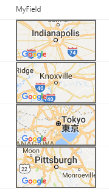

# Display a Google Maps Image for a Location

## Podsumowanie
This template takes advantage of Google Maps' [staticmap API](https://developers.google.com/maps/documentation/static-maps/) which generates an image using a parameterized URL. The template only uses the most basic features ([location](https://developers.google.com/maps/documentation/static-maps/intro#Locations) & [image size](https://developers.google.com/maps/documentation/static-maps/intro#Imagesizes), but the API offers deep customization including:

- [Zoom Levels](https://developers.google.com/maps/documentation/static-maps/intro#Zoomlevels)
- [Scale Values](https://developers.google.com/maps/documentation/static-maps/intro#scale_values)
- [Map Types](https://developers.google.com/maps/documentation/static-maps/intro#MapTypes)
- [Custom Styling](https://developers.google.com/maps/documentation/static-maps/styling)
- [Pins (Markers)](https://developers.google.com/maps/documentation/static-maps/intro#Markers)
- [Paths](https://developers.google.com/maps/documentation/static-maps/intro#Paths)
- And more!

In this template we are just using the current field's value as the location, but you could easily make very advanced maps by combining multiple column values across your list item.

To add additional parameters, just continue to add operands in the + operation!

### API key

The key provided in the template (the ugly text after `&key`) should be changed to your own FREE API Key. This will ensure you don't receive errors from over usage of a shared key. Getting a key takes 2 minutes and is FREE: [Get API Key](https://developers.google.com/maps/documentation/static-maps/get-api-key)

>Note: Failure to switch the key to your own key leaves you open to future issues as other users use this key or if this key were to be revoked.

### Column Types
Ten format będzie działać z Choice and Text columns without any changes. To use Lookup columns, you'll need to change the 2 occurences of `@currentField` to `@currentField.lookupValue`.

The values are expected to be addresses such as Indianapolis, IN or Tokyo or 123 Main St. Knoxville, TN.

## Wymagania widoku
- Ten format można zastosować do a text/choice field where the value is expected to be a location

## Przykład

Rozwiązanie|Autor(zy)
--------|---------
generic-staticmap.json | [Chris Kent](https://github.com/thechriskent)

## Historia wersji

Wersja|Data|Uwagi
-------|----|--------
1.0|March 21, 2018|Wersja początkowa
1.1|August 20, 2018|Switched to Excel-style expressions

## Zastrzeżenie
**TEN KOD JEST DOSTARCZANY W STANIE *TAKIM, W JAKIM JEST*, BEZ JAKIEJKOLWIEK GWARANCJI, WYRAŹNEJ ANI DOROZUMIANEJ, W TYM TAKŻE DOROZUMIANYCH GWARANCJI PRZYDATNOŚCI DO OKREŚLONEGO CELU, WARTOŚCI HANDLOWEJ ANI NIENARUSZANIA PRAW.**

---

## Dodatkowe uwagi
This template is included in the [Column Formatter](https://github.com/SharePoint/sp-dev-solutions/blob/master/solutions/ColumnFormatter/README.md) webpart.

- [Użyj formatowania kolumn do dostosowania SharePoint](https://docs.microsoft.com/en-us/sharepoint/dev/declarative-customization/column-formatting)

> An additional version using Abstract Tree Syntax (AST) is also provided for environments where the Excel-style expressions are not supported.

