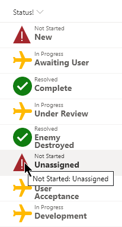

# Substring Status

## Podsumowanie
Ten format pokazuje użycie kombinacji operacji `substring` i `indexOf`, aby "podzielić" wartość i podejmować decyzje o stylu na podstawie jej fragmentów. W tym przypadku wartości statusu są rozdzielone dwukropkiem (`:`). Pierwsza część to ogólna kategoria, taka jak Not Started, In Progress lub Resolved. Druga część to szczegółowy powód statusu. Ponieważ te wartości znajdują się w tej samej kolumnie, konieczne jest ich rozdzielenie.

The value before the colon is used to set an icon and font-color as well as being displayed in it's own `span` element. The value after the colon is used to display the details in a secondary `span` element.

## Wymagania widoku
- Ten format można zastosować do a text/choice column but expects values similar to:
  - Not Started: New
  - Not Started: Delayed
  - Not Started: Unassigned
  - In Progress: Under Review
  - In Progress: Awaiting User
  - In Progress: Development
  - In Progress: Testing
  - In Progress: User Acceptance
  - Resolved: Complete
  - Resolved: Withdrawn
  - Resolved: As Designed
  - Resolved: Integration Failure
  - Resolved: Answered
  - Resolved: Can't Reproduce
  - Resolved: Enemy Destroyed

## Przykład

Rozwiązanie|Autor(zy)
--------|---------
generic-substring-status.json | [Chris Kent](https://github.com/thechriskent)

## Historia wersji

Wersja|Data|Uwagi
-------|----|--------
1.0|February 6, 2020|Wersja początkowa

## Zastrzeżenie
**TEN KOD JEST DOSTARCZANY W STANIE *TAKIM, W JAKIM JEST*, BEZ JAKIEJKOLWIEK GWARANCJI, WYRAŹNEJ ANI DOROZUMIANEJ, W TYM TAKŻE DOROZUMIANYCH GWARANCJI PRZYDATNOŚCI DO OKREŚLONEGO CELU, WARTOŚCI HANDLOWEJ ANI NIENARUSZANIA PRAW.**

---

## Dodatkowe uwagi

- [Użyj formatowania kolumn do dostosowania SharePoint](https://docs.microsoft.com/en-us/sharepoint/dev/declarative-customization/column-formatting#me)

