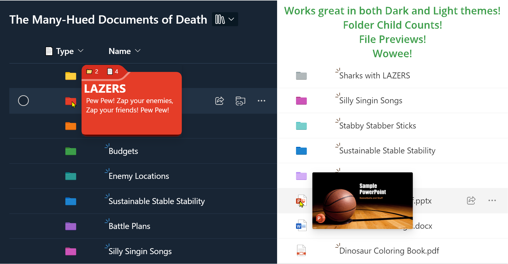

# Generic Super Type

## Podsumowanie
Ta próbka pokazuje recreating the `Type` column (folder/file icons) and adds meaningful hover panels. Shows you how to take advantage of SharePoint folder colors by referencing the `[$_ColorHex]` field. Additionally, demonstrates 2 different ways of using the `filepreview` element to show a file type icon and also a thumbnail preview of the file.

### Folder Colors

|Color|_ColorHex value|
|---|---|
|Yellow|Empty or 0|
|Dark red|1|
|Dark orange|2|
|Dark green|3|
|Dark teal|4|
|Dark blue|5|
|Dark purple|6|
|Dark pink|7|
|Grey|8|
|Light red|9|
|Light orange|10|
|Light green|11|
|Light teal|12|
|Light blue|13|
|Light purple|14|
|Light pink|15|

## Wymagania widoku

Ten format można zastosować do any column in your Document Library.

## Przykład

Rozwiązanie|Autor(zy)
--------|---------
generic-supertype.json | [Chris Kent](https://github.com/thechriskent)

## Historia wersji

Wersja|Data|Uwagi
-------|----|--------
1.0|9 listopada 2023|Wersja początkowa

## Zastrzeżenie
**TEN KOD JEST DOSTARCZANY W STANIE *TAKIM, W JAKIM JEST*, BEZ JAKIEJKOLWIEK GWARANCJI, WYRAŹNEJ ANI DOROZUMIANEJ, W TYM TAKŻE DOROZUMIANYCH GWARANCJI PRZYDATNOŚCI DO OKREŚLONEGO CELU, WARTOŚCI HANDLOWEJ ANI NIENARUSZANIA PRAW.**

---

## Dodatkowe uwagi

- [Użyj formatowania kolumn do dostosowania SharePoint](https://docs.microsoft.com/en-us/sharepoint/dev/declarative-customization/column-formatting)
- [Create Folders with Colors using Power Automate](https://www.expiscornovus.com/2023/10/11/create-coloured-folder/) by [Expicornovus](https://pnp.github.io/List-Formatting/groupings/author/#dennis)
- [Create Folders with Colors using PnP.PowerShell](https://pnp.github.io/script-samples/spo-create-colored-folder/README.html?tabs=pnpps) by [Tetsuya Kawahara](https://pnp.github.io/List-Formatting/groupings/author/#tetsuya-kawahara) and [Ganesh Sanap](https://pnp.github.io/List-Formatting/groupings/author/#ganesh-sanap)

