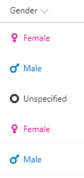

# SVG icons

## Podsumowanie
The [Fluent UI icons](https://flicon.io) are easy to use in column formatting by simply specifying the name in the `iconName` attribute. However, the available selection of icons may not always meet your needs.

Fortunately, you can use inline SVG elements with custom paths. This means you can use icons from sources like Font Awesome that provide SVG versions of their icons!

Ta próbka wykorzystuje the value of the current field to show a custom icon and color. The icon is specified through the `d` attribute of the path element. The paths have been scaled and extracted from Font Awesome icons. Ta próbka wykorzystuje gender and provides a default display when neither Male nor Female is selected.

|Value|Icon|Color|
|---|---|---|
|Female|[venus](https://fontawesome.com/icons/venus?style=solid)|#e3008c|
|Male|[mars](https://fontawesome.com/icons/mars?style=solid)|#0078d7|
|DEFAULT|[genderless](https://fontawesome.com/icons/genderless?style=solid)|#333333|

The pattern of using nested conditional operators with equality operators is the column formatting equivalent of a switch statement. The same logic is used 3 times in this sample. First for the `svg`'s `fill` style attribute to determine the color of the icon. Next, it is used for the `d` attribute of the `svg` element's `path` element to change the icon. Finally, it is used for the `span`'s `color` style attribute to ensure the text color is also changed.

## Wymagania widoku
- Ten format można zastosować do a text/choice column and uses the values Female, Male, or anything else

## Przykład

Rozwiązanie|Autor(zy)
--------|---------
generic-svgicon-format.json | [Chris Kent](https://github.com/thechriskent)

## Historia wersji

Wersja|Data|Uwagi
-------|----|--------
1.0|26 marca 2018|Wersja początkowa
1.1|20 sierpnia 2018|Przełączono na wyrażenia w stylu Excela

## Zastrzeżenie
**TEN KOD JEST DOSTARCZANY W STANIE *TAKIM, W JAKIM JEST*, BEZ JAKIEJKOLWIEK GWARANCJI, WYRAŹNEJ ANI DOROZUMIANEJ, W TYM TAKŻE DOROZUMIANYCH GWARANCJI PRZYDATNOŚCI DO OKREŚLONEGO CELU, WARTOŚCI HANDLOWEJ ANI NIENARUSZANIA PRAW.**

---

## Dodatkowe uwagi

The icons used were adapted from Font Awesome which is available under the [Creative Commons Attribution 4.0 International license](https://fontawesome.com/license).

- [Użyj formatowania kolumn do dostosowania SharePoint](https://docs.microsoft.com/en-us/sharepoint/dev/declarative-customization/column-formatting#me)

- [Use Font Awesome icons in Column Formatting](https://thechriskent.com/2018/03/25/use-font-awesome-icons-in-column-formatting/).

> Dodatkowa wersja wykorzystująca Abstract Tree Syntax (AST) jest również dostępna dla środowisk, w których wyrażenia w stylu Excela nie są obsługiwane.

