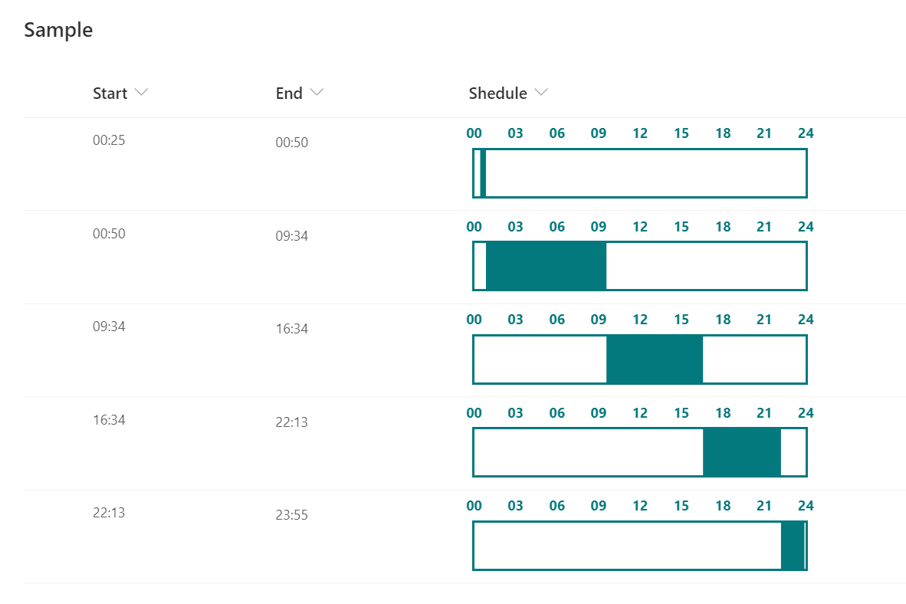

# Time Schedule

## Podsumowanie
Ta próbka pokazuje a time schedule with a filled background from `Start` time to `End` time.

## Wymagania widoku
Ten format można zastosować do any column type but expects the following columns to be part of the view:

|Type|Internal Name|Wymagane|
|---|---|:---:|
|Pojedyncza linia tekstu or Choice|Start|Yes|
|Pojedyncza linia tekstu or Choice|End|Yes|

`Start` and `End` columns must be in `hh:mm` format.

## Przykład

Rozwiązanie|Autor(zy)
--------|---------
generic-time-schedule.json | [Tetsuya Kawahara](https://github.com/tecchan1107)

## Historia wersji

Wersja |Data             |Uwagi
--------|-----------------|--------
1.0     |listopada 3, 2020 |Wersja początkowa

## Zastrzeżenie
**TEN KOD JEST DOSTARCZANY W STANIE *TAKIM, W JAKIM JEST*, BEZ JAKIEJKOLWIEK GWARANCJI, WYRAŹNEJ ANI DOROZUMIANEJ, W TYM TAKŻE DOROZUMIANYCH GWARANCJI PRZYDATNOŚCI DO OKREŚLONEGO CELU, WARTOŚCI HANDLOWEJ ANI NIENARUSZANIA PRAW.**

