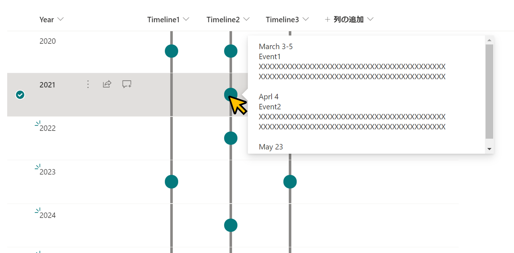

# Timeline Format

## Podsumowanie
Ta próbka pokazuje displaying a timeline in a column. If the column value is empty, no circle will be displayed. The content of the column will be shown in a popup when you click on the dot.

## Wymagania widoku
Ten format można zastosować do any column type.

## Przykład

Rozwiązanie|Autor(zy)
--------|---------
generic-timeline.json | [Tetsuya Kawahara](https://github.com/tecchan1107)

## Historia wersji

Wersja |Data         |Uwagi
--------|-------------|----------------
1.0     |May 14, 2021 |Wersja początkowa

## Zastrzeżenie
**TEN KOD JEST DOSTARCZANY W STANIE *TAKIM, W JAKIM JEST*, BEZ JAKIEJKOLWIEK GWARANCJI, WYRAŹNEJ ANI DOROZUMIANEJ, W TYM TAKŻE DOROZUMIANYCH GWARANCJI PRZYDATNOŚCI DO OKREŚLONEGO CELU, WARTOŚCI HANDLOWEJ ANI NIENARUSZANIA PRAW.**

