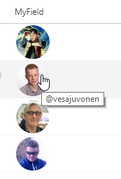

# Twitter Profile Pics

## Podsumowanie

Using just the Twitter handle, Twitter profile pictures are displayed in a circle and clicking them will open the user's Twitter page in a new window. The handle is also displayed as a tooltip when hovering over the profile image.

> Note: Twitter updated the [Twitter profile pictures](https://developer.twitter.com/en/docs/accounts-and-users/user-profile-images-and-banners) API and will not return an image using the "https://twitter.com/username/profileimage" request under certain circumstances. Twitter will redirect to another more cryptic image URL and return a 403 error to SharePoint. This only happens when currently logged into Twitter in the same browser session as the SharePoint session. If NOT logged into Twitter, the "https://twitter.com/username/profileimage" request succeeds.

> Alternative API for returning Twitter pic is replacing "https://twitter.com/username/profileimage" with a http://avatars.io service request using the following format: "http://avatars.io/twitter/username". For examples of how to use this approach, see the [generic-socialpic](../generic-socialpic) sample.

### Image Size

[Twitter profile pictures](https://developer.twitter.com/en/docs/accounts-and-users/user-profile-images-and-banners) come in 3 standard sizes:

|Name|Size|
|---|:---:|
|mini|24x24|
|normal|48x48|
|bigger|73x73|

> There's actually another "size", `original`, that returns the image using the original proportions as uploaded by the user. This doesn't work well for listviews since there is so much variation, but it is available if you customize the code and change the relevant part of the `src` url to `?size=original`.

To change the size, adjust the portion of the `src` url to use the keyword from the table above and then adjust the `width` and `height` style attributes for the containing `div`.

### Column Types
Ten format będzie działać z Choice and Text columns without any changes. To use Lookup columns, you'll need to change the 2 occurences of `@currentField` to `@currentField.lookupValue`.

The field values are case insensitve and should be just the user's twitter handle with no @.

## Wymagania widoku
- Ten format można zastosować do a text/choice column and expects the values to be twitter handles

## Przykład

Rozwiązanie|Autor(zy)
--------|---------
generic-twitterpic.json | [Chris Kent](https://github.com/thechriskent)

## Historia wersji

Wersja|Data|Uwagi
-------|----|--------
1.0|March 21, 2018|Wersja początkowa
1.1|August 20, 2018|Updated to use Excel-style expressions

## Zastrzeżenie
**TEN KOD JEST DOSTARCZANY W STANIE *TAKIM, W JAKIM JEST*, BEZ JAKIEJKOLWIEK GWARANCJI, WYRAŹNEJ ANI DOROZUMIANEJ, W TYM TAKŻE DOROZUMIANYCH GWARANCJI PRZYDATNOŚCI DO OKREŚLONEGO CELU, WARTOŚCI HANDLOWEJ ANI NIENARUSZANIA PRAW.**

---

## Dodatkowe uwagi

A similar wizard is also included in the [Column Formatter](https://github.com/SharePoint/sp-dev-solutions/blob/master/solutions/ColumnFormatter/README.md) webpart that allows full customization.

- [Użyj formatowania kolumn do dostosowania SharePoint](https://docs.microsoft.com/en-us/sharepoint/dev/declarative-customization/column-formatting)

> An additional version using Abstract Tree Syntax (AST) is also provided for environments where the Excel-style expressions are not supported.

