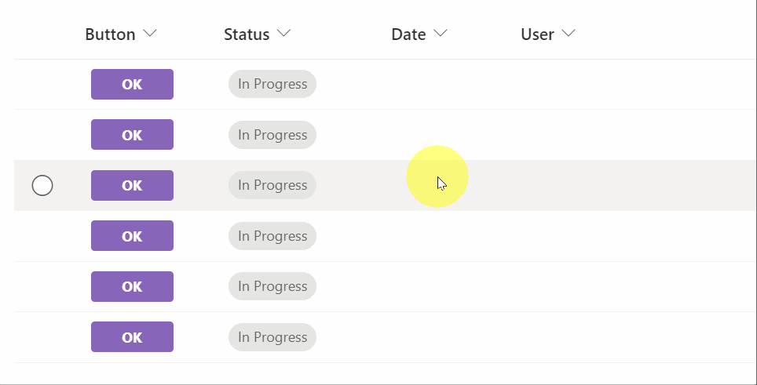
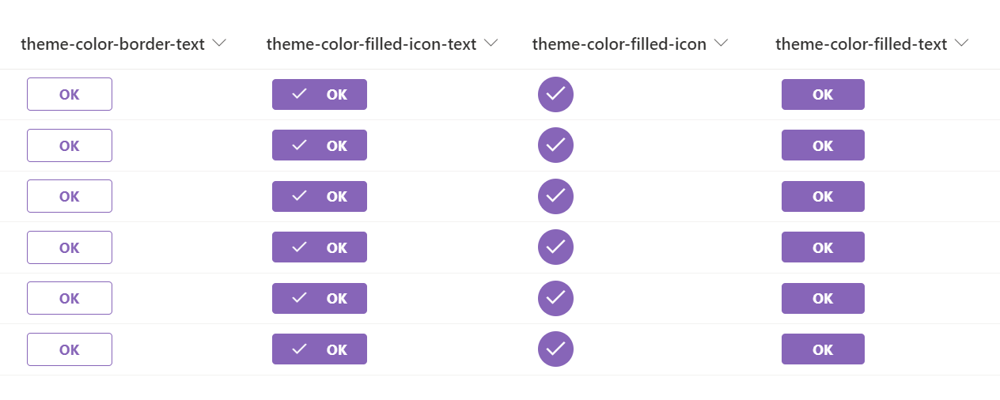
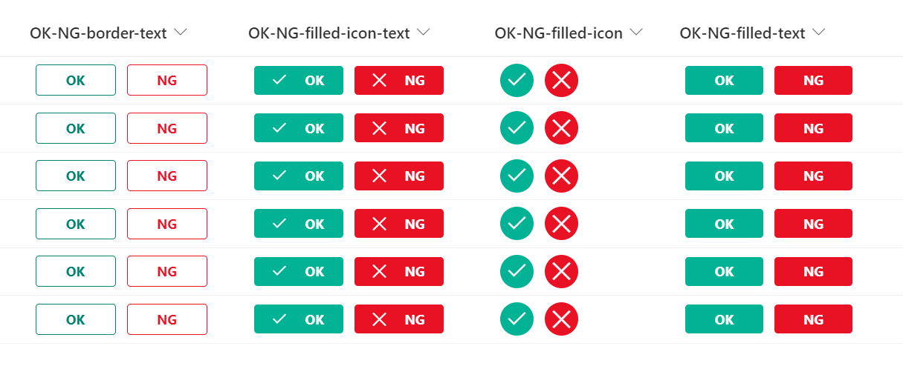

# Field Value Update Button

## Podsumowanie
Ta próbka pokazuje displaying a button to update the fields values of an item.

In this sample, there are 8 types of buttons as follows.

### How to change the text on the button
If you want to change the text of the button, change the value of the `txtContent` property.

### How to change the icon
If you want to change the icon, refer to [Fluent UI Icons](https://developer.microsoft.com/en-us/fluentui#/styles/web/icons) and change the value of the `iconName` property.

### How to change the field to be updated
If you want to change the field to be updated, refer to [Microsoft Docs](https://docs.microsoft.com/en-us/sharepoint/dev/declarative-customization/formatting-advanced#set-multiple-field-values-of-an-item-using-customrowaction) and change the value of the `actionInput` property.

### How to set the button to show or hide
If you want to show or hide the button, change the value of the `display` property.

## Wymagania widoku
Ten format można zastosować do any column type but expects the following columns to be part of the view:

|Type            |Internal Name |Wymagane|
|----------------|--------------|:------:|
|Choice          |Status        |No      |
|Data and Time   |Data          |No      |
|Person or Group |User          |No      |

## Przykład

Rozwiązanie|Autor(zy)
--------|---------
generic-update-button.json | [Tetsuya Kawahara](https://github.com/tecchan1107)
generic-update-button-theme-color-filled-icon-text.json | [Tetsuya Kawahara](https://github.com/tecchan1107)
generic-update-button-theme-color-filled-icon.json | [Tetsuya Kawahara](https://github.com/tecchan1107)
generic-update-button-theme-color-filled-text.json | [Tetsuya Kawahara](https://github.com/tecchan1107)
generic-update-button-OK-NG-border-text.json | [Tetsuya Kawahara](https://github.com/tecchan1107)
generic-update-button-OK-NG-filled-icon-text.json | [Tetsuya Kawahara](https://github.com/tecchan1107)
generic-update-button-OK-NG-filled-icon.json | [Tetsuya Kawahara](https://github.com/tecchan1107)
generic-update-button-OK-NG-filled-text.json | [Tetsuya Kawahara](https://github.com/tecchan1107)

## Historia wersji

Wersja |Data          |Uwagi
--------|--------------|--------
1.0     |kwietnia 2, 2022 |Wersja początkowa

## Zastrzeżenie
**TEN KOD JEST DOSTARCZANY W STANIE *TAKIM, W JAKIM JEST*, BEZ JAKIEJKOLWIEK GWARANCJI, WYRAŹNEJ ANI DOROZUMIANEJ, W TYM TAKŻE DOROZUMIANYCH GWARANCJI PRZYDATNOŚCI DO OKREŚLONEGO CELU, WARTOŚCI HANDLOWEJ ANI NIENARUSZANIA PRAW.**

