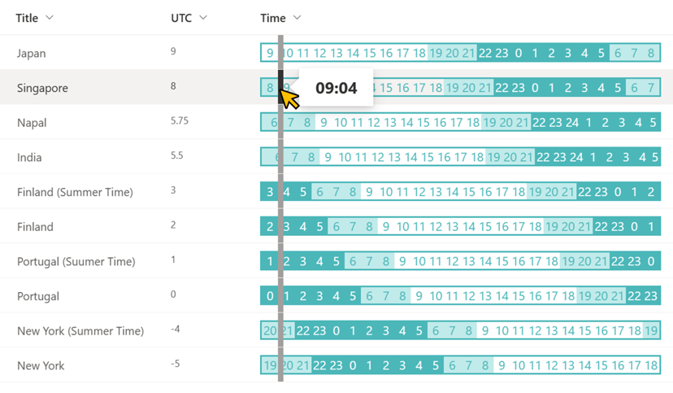

# World Current Time

## Podsumowanie
Ta próbka pokazuje the side-by-side display and comparison of the current time in different countries around the world.

## Wymagania widoku
Ten format można zastosować do any column type but expects the following columns to be part of the view:

|Type   |Internal Name |Required|
|-------|--------------|:------:|
|Number |UTC           |Yes     |

## Przykład

Rozwiązanie|Autor(zy)
--------|---------
generic-world-time.json | [Tetsuya Kawahara](https://github.com/tecchan1107)

## Historia wersji

Wersja |Data           |Uwagi
--------|---------------|--------
1.0     |April 17, 2022 |Wersja początkowa
1.1     |March 3, 2023  |Poprawiono to the method using the split operator.
1.2     |August 30, 2024 |Poprawiono that the right border was no longer displayed.

## Zastrzeżenie
**TEN KOD JEST DOSTARCZANY W STANIE *TAKIM, W JAKIM JEST*, BEZ JAKIEJKOLWIEK GWARANCJI, WYRAŹNEJ ANI DOROZUMIANEJ, W TYM TAKŻE DOROZUMIANYCH GWARANCJI PRZYDATNOŚCI DO OKREŚLONEGO CELU, WARTOŚCI HANDLOWEJ ANI NIENARUSZANIA PRAW.**

