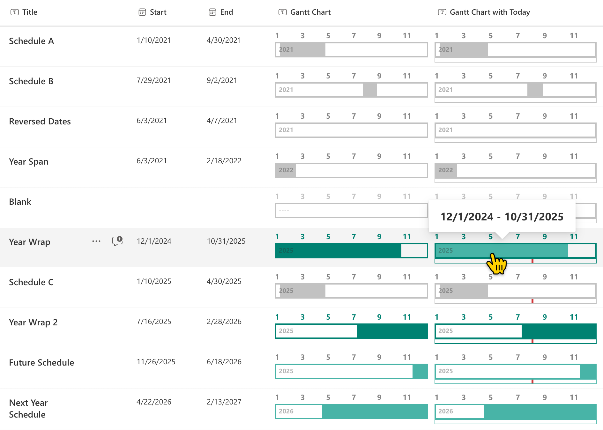

# Yearly Gantt Chart

## Podsumowanie
Ta próbka pokazuje the display of a yearly Gantt chart.

- Schedules prior to the current date are shown with neutral colors
- Schedules containing the current date are shown with primary theme colors
- Schedules later than the current date are shown with light theme colors
- Year shown is the either the current year for active schedules,the last year of a past schedule, or the first year of a future schedule
- Full schedule date range is shown on hover

## Wymagania widoku

Ten format można zastosować do any column type but expects the following columns to be part of the view:

|Type               |Internal Name|Wymagane|
|-------------------|-------------|:------:|
|DateTime           |Start        |Yes     |
|DateTime           |End          |Yes     |

## Przykład

Rozwiązanie|Autor(zy)
--------|---------
generic-yearly-gantt-chart.json | [Tetsuya Kawahara](https://github.com/tecchan1107), [Chris Kent](https://github.com/thechriskent)
generic-yearly-gantt-chart-with-today.json | [Alvin Fong](https://github.com/hakki-max), [DRVRogo](https://github.com/DRVRogo), [Chris Kent](https://github.com/thechriskent)

## Historia wersji

Wersja |Data          |Uwagi
--------|--------------|--------------------------------
1.0     |kwietnia 12, 2021|Wersja początkowa
1.1     |sierpnia 27, 2022|Dodano generic-yearly-gantt-chart-with-today.json
1.2.    |sierpnia 9, 2025|Latest year is prioritized in ranges that span across years (unless first year is current year), neutral colors used for ranges outside current year

## Zastrzeżenie
**TEN KOD JEST DOSTARCZANY W STANIE *TAKIM, W JAKIM JEST*, BEZ JAKIEJKOLWIEK GWARANCJI, WYRAŹNEJ ANI DOROZUMIANEJ, W TYM TAKŻE DOROZUMIANYCH GWARANCJI PRZYDATNOŚCI DO OKREŚLONEGO CELU, WARTOŚCI HANDLOWEJ ANI NIENARUSZANIA PRAW.**

