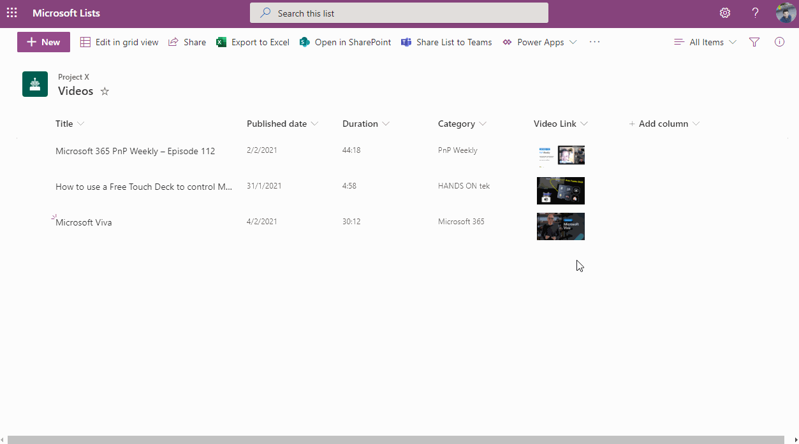

# YouTube Thumbnail

## Podsumowanie
Ta próbka przedstawia a thumbnail of a YouTube video that links to the video and a larger preview image on hover.

## Wymagania widoku
- Ten format można zastosować do any text column but expects that value to be a URL to a YouTube video. The `Title` column is also used in the hover card.

## Przykład

Rozwiązanie|Autor(zy)
--------|---------
generic-youtube-thumbnail.json | [João Ferreira](https://github.com/joaoferreira)

## Historia wersji

Wersja|Data|Uwagi
-------|----|--------
1.0|February 10, 2021|Wersja początkowa

## Zastrzeżenie
**TEN KOD JEST DOSTARCZANY W STANIE *TAKIM, W JAKIM JEST*, BEZ JAKIEJKOLWIEK GWARANCJI, WYRAŹNEJ ANI DOROZUMIANEJ, W TYM TAKŻE DOROZUMIANYCH GWARANCJI PRZYDATNOŚCI DO OKREŚLONEGO CELU, WARTOŚCI HANDLOWEJ ANI NIENARUSZANIA PRAW.**

