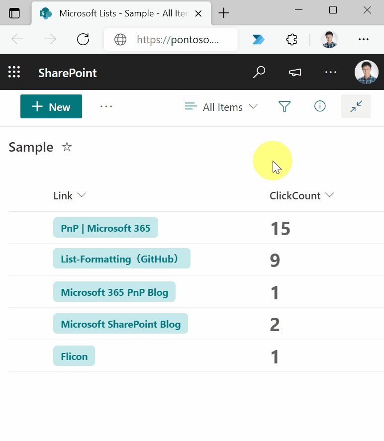

# Count the Liczba of Clicks on a Link

## Podsumowanie
Ta próbka pokazuje counting the number of clicks on a link. By keeping track of the number of link clicks, you can figure out which links are popular with users.

## Wymagania widoku

|Type      |Internal Name|Wymagane|
|----------|-------------|:------:|
|Hyperlink |Link         |Yes     |
|Liczba    |ClickCount   |No      |

## Przykład

Rozwiązanie|Autor(zy)
--------|---------
hyperlink-click-count.json | [Tetsuya Kawahara](https://github.com/tecchan1107)

## Historia wersji

Wersja |Data              |Uwagi
--------|------------------|--------
1.0     |grudnia 11, 2021 |Wersja początkowa

## Zastrzeżenie
**TEN KOD JEST DOSTARCZANY W STANIE *TAKIM, W JAKIM JEST*, BEZ JAKIEJKOLWIEK GWARANCJI, WYRAŹNEJ ANI DOROZUMIANEJ, W TYM TAKŻE DOROZUMIANYCH GWARANCJI PRZYDATNOŚCI DO OKREŚLONEGO CELU, WARTOŚCI HANDLOWEJ ANI NIENARUSZANIA PRAW.**

