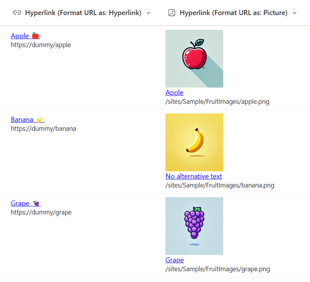

# Display URLs in Hyperlink Column

## Podsumowanie

Ta próbka pokazuje displaying a URL in a hyperlink column. By showing the URL, users can preview the linked site or page before clicking on the link. Additionally, making the URL visible allows users to quickly identify the link’s destination during maintenance, making it easier to modify or update.

## Wymagania widoku

Ten format można zastosować do a Hyperlink column.

## Przykład

Rozwiązanie|Autor(zy)
--------|---------
hyperlink-display-url.json | [Watana](https://github.com/watana2) & [Tetsuya Kawahara](https://github.com/tecchan1107)
hyperlink-display-url-format-picture.json | [Watana](https://github.com/watana2) & [Tetsuya Kawahara](https://github.com/tecchan1107)

## Historia wersji

Wersja |Data            |Uwagi
--------|----------------|--------
1.0     |September 16, 2024 |Wersja początkowa

## Zastrzeżenie
**TEN KOD JEST DOSTARCZANY W STANIE *TAKIM, W JAKIM JEST*, BEZ JAKIEJKOLWIEK GWARANCJI, WYRAŹNEJ ANI DOROZUMIANEJ, W TYM TAKŻE DOROZUMIANYCH GWARANCJI PRZYDATNOŚCI DO OKREŚLONEGO CELU, WARTOŚCI HANDLOWEJ ANI NIENARUSZANIA PRAW.**

