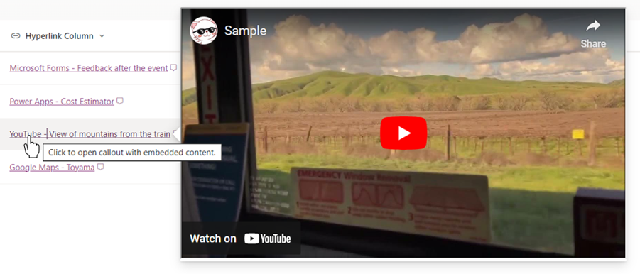
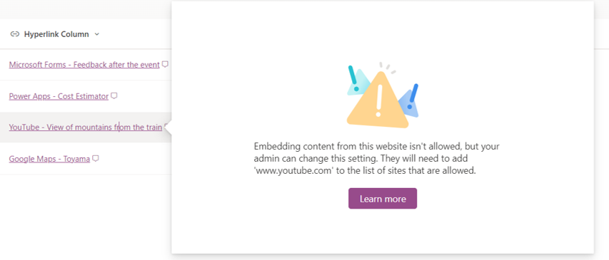
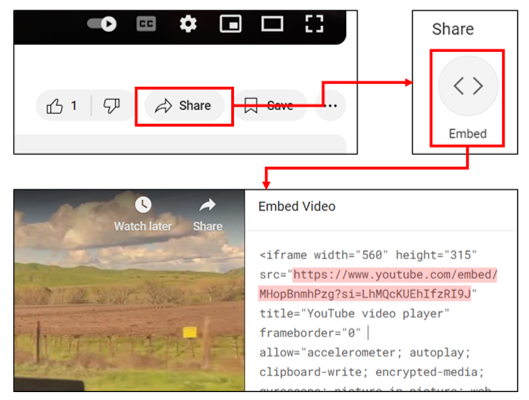
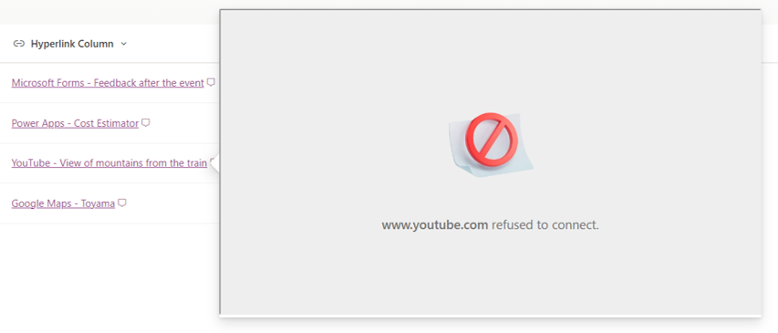

# Displaying Embedded Content Using the `embed` Action

## Podsumowanie

Ta próbka pokazuje displaying embedded content using the `embed` action.

> [!NOTE]  
> - This sample and the `embed` action are only available in the newer version of the Microsoft Lists App.

## Wymagania wstępne

### Allowing Embedding in HTML Field Security Settings

To embed content, the target site must be allowed for embedding. For guidance on how to allow embedding, please refer to [Allow or restrict the ability to embed content on SharePoint Lists using custom formatters](https://go.microsoft.com/fwlink/p/?linkid=2258033).

If you try to embed a site that is not allowed to be embedded, the following error screen will appear:

### Obtaining and Setting the Embedding URL

The URL in the hyperlink column must be set to an embedding URL. This URL is usually found in the `src` attribute of the `iframe` element.

For example, the embedding URL for YouTube can be obtained as follows:

1. Open the desired video on YouTube
1. Select the **Share** button
1. Select the **Embed** button
1. Copy the URL from the `src` attribute in the embed code

    

If the URL is not an embedding URL, the following error screen may appear:

## Wymagania widoku

Ten format można zastosować do a Hyperlink column.

## Przykład

Rozwiązanie|Autor(zy)
--------|---------
hyperlink-embed.json | [Tetsuya Kawahara](https://github.com/tecchan1107)

## Historia wersji

Wersja |Data            |Uwagi
--------|----------------|--------
1.0     |August 27, 2024 |Wersja początkowa

## Zastrzeżenie
**TEN KOD JEST DOSTARCZANY W STANIE *TAKIM, W JAKIM JEST*, BEZ JAKIEJKOLWIEK GWARANCJI, WYRAŹNEJ ANI DOROZUMIANEJ, W TYM TAKŻE DOROZUMIANYCH GWARANCJI PRZYDATNOŚCI DO OKREŚLONEGO CELU, WARTOŚCI HANDLOWEJ ANI NIENARUSZANIA PRAW.**

---

## Dodatkowe uwagi

- The `embed` action is described in [Formatting syntax reference - customRowAction](https://learn.microsoft.com/sharepoint/dev/declarative-customization/formatting-syntax-reference#customrowaction)

