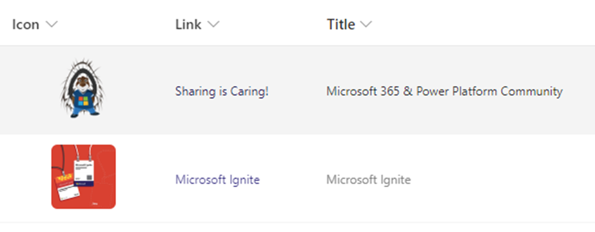

# Changing Image Hyperlink Standard Behavior

## Podsumowanie
If you click on an image in a SharePoint list, the image is displayed as a preview. This formatter changes the standard behavior in which a link from another column is used. In this way, a click on the image has the same behavior as if the link had been clicked directly.

## Wymagania widoku
- A column of type image containing this column formatter
- A hyperlink column (Internal Name: Link) that contains the target link.

## Przykład

Rozwiązanie|Autor(zy)
--------|---------
image-hyperlink.json | [Hagen Deike](https://github.com/samurai-ka) ([@samurai@sueden.social](https://sueden.social/@samurai))

## Historia wersji

Wersja|Data|Uwagi
-------|----|--------
1.0|November 21, 2024|Wersja początkowa
1.1|November 21, 2024|Using columns link description instead of title

## Zastrzeżenie

**TEN KOD JEST DOSTARCZANY W STANIE *TAKIM, W JAKIM JEST*, BEZ JAKIEJKOLWIEK GWARANCJI, WYRAŹNEJ ANI DOROZUMIANEJ, W TYM TAKŻE DOROZUMIANYCH GWARANCJI PRZYDATNOŚCI DO OKREŚLONEGO CELU, WARTOŚCI HANDLOWEJ ANI NIENARUSZANIA PRAW.**

---

## Dodatkowe uwagi

- Change the Image size on line 21
- To remove rounded corners, remove the image style on line 24-26
- Padding between the rows can be tweaked on line 6 & 7
- Choose how the link opens in the browser on line 14. "_blank" for new window/tab, or "_self" for the same window.

