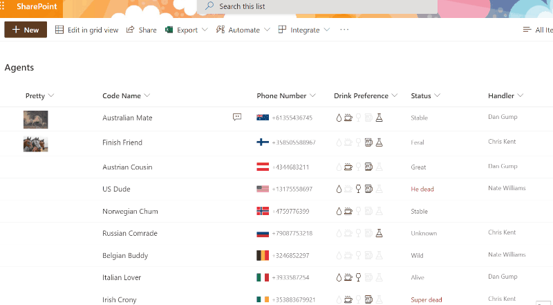
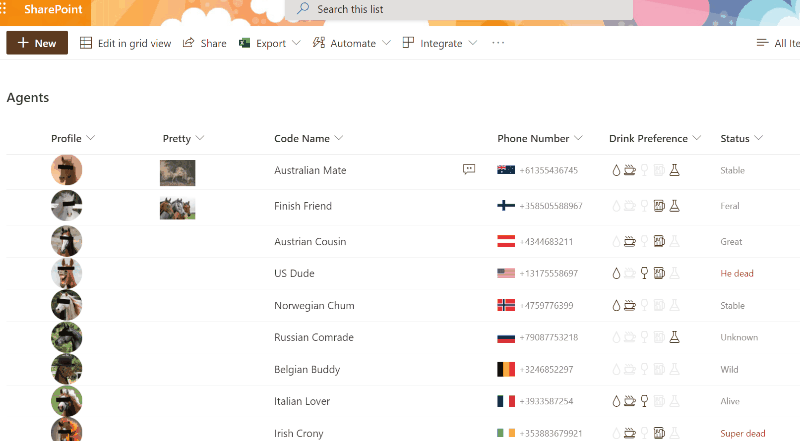

# Image Lightbox

## Podsumowanie
Ta próbka pokazuje showing the full size image in a lightbox (hover card) rather than opening this image in a new window.

### Taking it further

An additional format (image-lightbox-advanced.json) is provided which demonstrates the same lightbox effects but dynamically scales the lightbox image based on the window size (50% of the rendered inner width/height). This format also adds a link in the bottom right corner of the hoverbox to open the image in a new window (matches the standard Image display behavior).

## Wymagania widoku
- Ten format można zastosować do any image column type (Note: this sample does not work with the Picture column type)

## Przykład

Rozwiązanie|Autor(zy)
--------|---------
image-lightbox.json | [João Ferreira](https://github.com/joaoferreira)
image-lightbox-advanced.json | [Chris Kent](https://github.com/thechriskent)

## Historia wersji

Wersja|Data|Uwagi
-------|----|--------
1.0|February 10, 2020|Wersja początkowa
1.1|July 8, 2021|Dodano advanced format
1.2|October 26, 2023|Updated samples to use getThumbnailImage

## Zastrzeżenie
**TEN KOD JEST DOSTARCZANY W STANIE *TAKIM, W JAKIM JEST*, BEZ JAKIEJKOLWIEK GWARANCJI, WYRAŹNEJ ANI DOROZUMIANEJ, W TYM TAKŻE DOROZUMIANYCH GWARANCJI PRZYDATNOŚCI DO OKREŚLONEGO CELU, WARTOŚCI HANDLOWEJ ANI NIENARUSZANIA PRAW.**

