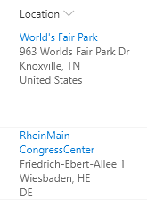

# Display Location Address Details

## Podsumowanie

Location columns provide several properties that can be accessed to provide more information to users. This sample pulls out sub properties to turn the standard Display Name only to a full address and provides a link to Bing Maps for a given location.

> Note: Location columns do not currently have the "Format this column" option in the column menu. Instead, formats to these columns need to be applied through the Field Settings screen for the column.

## Wymagania widoku
- Ten format można zastosować do a location column

## Przykład

Rozwiązanie|Autor(zy)
--------|---------
location-address.json | [Chris Kent](https://github.com/thechriskent)
## Historia wersji

Wersja|Data|Uwagi
-------|----|--------
1.0|21 sierpnia 2019|Wersja początkowa

## Zastrzeżenie
**TEN KOD JEST DOSTARCZANY W STANIE *TAKIM, W JAKIM JEST*, BEZ JAKIEJKOLWIEK GWARANCJI, WYRAŹNEJ ANI DOROZUMIANEJ, W TYM TAKŻE DOROZUMIANYCH GWARANCJI PRZYDATNOŚCI DO OKREŚLONEGO CELU, WARTOŚCI HANDLOWEJ ANI NIENARUSZANIA PRAW.**

---

