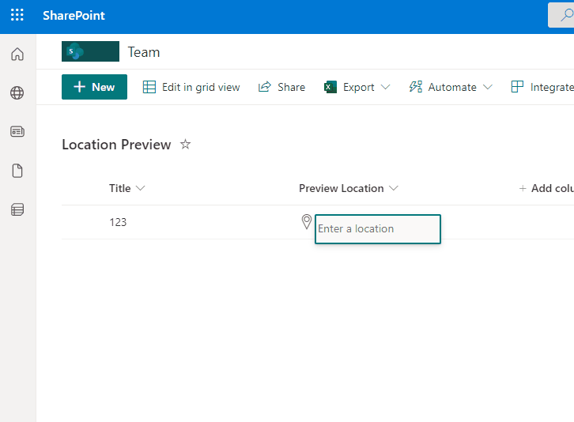

# Location Bing Maps

## Podsumowanie
Ta próbka pokazuje how to use a Location column to display details and a Map from Bing.

## Wymagania widoku
- Ten format można zastosować do any `Location` Column.

## Przykład

Rozwiązanie|Autor(zy)
--------|---------
location-bing-maps.json | [André Lage](https://github.com/aaclage)

## Historia wersji

Wersja|Data|Uwagi
-------|----|--------
1.0|27 maja 2022|Wersja początkowa

## Zastrzeżenie
**TEN KOD JEST DOSTARCZANY W STANIE *TAKIM, W JAKIM JEST*, BEZ JAKIEJKOLWIEK GWARANCJI, WYRAŹNEJ ANI DOROZUMIANEJ, W TYM TAKŻE DOROZUMIANYCH GWARANCJI PRZYDATNOŚCI DO OKREŚLONEGO CELU, WARTOŚCI HANDLOWEJ ANI NIENARUSZANIA PRAW.**

---

