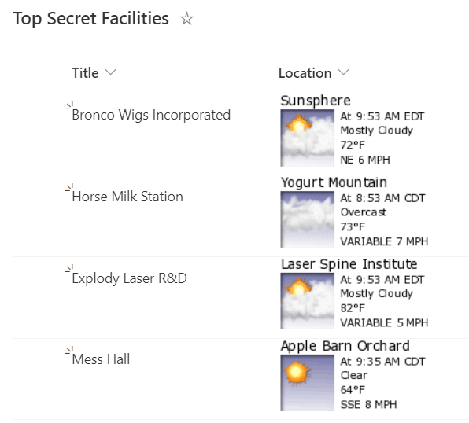

# Display Location Weather Details

## Podsumowanie

Ta próbka wykorzystuje właściwości podrzędne kolumny Location do zbudowania atrybutu `src` obrazu, który pobiera pogodę z [WeatherForYou.com](https://www.weatherforyou.com/).

> [!NOTE] 
> The WeatherForYou weather snapshots do NOT require an API key and is completely free to use. However, it is limited to locations within the United States only. Locations outside of the US will not show the format.

## Wymagania wstępne

Ta próbka wykorzystuje external images. These images are displayed only if their domains are explicitly allowed.

If your site allows only specific domains, add `www.weatherforyou.net` to the list of allowed domains in the **HTML Field Security** settings.

For more information, see: [Allow or restrict the ability to embed content on SharePoint pages](https://support.microsoft.com/office/allow-or-restrict-the-ability-to-embed-content-on-sharepoint-pages-e7baf83f-09d0-4bd1-9058-4aa483ee137b)

## Wymagania widoku
- Ten format można zastosować do a location column (to reference a location column instead you can switch the calls from `@currentField` to the column reference format. For example, `@currentField.Address.City` to `[$INTERNALNAME.Address.City]`)

## Przykład

Rozwiązanie|Autor(zy)
--------|---------
location-weather.json | [Chris Kent](https://github.com/thechriskent)

## Historia wersji

Wersja|Data|Uwagi
-------|----|--------
1.0|September 16, 2021|Wersja początkowa

## Zastrzeżenie
**TEN KOD JEST DOSTARCZANY W STANIE *TAKIM, W JAKIM JEST*, BEZ JAKIEJKOLWIEK GWARANCJI, WYRAŹNEJ ANI DOROZUMIANEJ, W TYM TAKŻE DOROZUMIANYCH GWARANCJI PRZYDATNOŚCI DO OKREŚLONEGO CELU, WARTOŚCI HANDLOWEJ ANI NIENARUSZANIA PRAW.**

---

