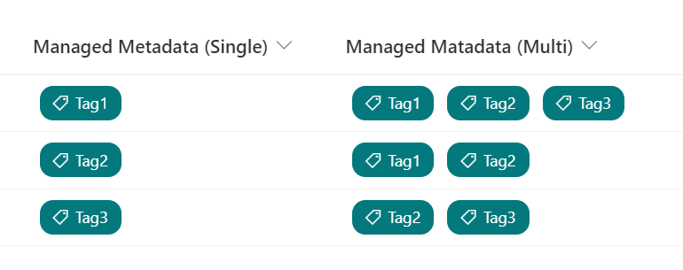

# Managed Metadata Tag Icon

## Podsumowanie
Ta próbka wyświetla ikonę tagu po lewej stronie wartości w kolumnie metadanych zarządzanych.

There are 2 versions of the sample included depending on if your Managed Metadata column is single or multi-value.

## Wymagania widoku
Ten format można zastosować do a Managed Metadata column.

## Przykład

Rozwiązanie|Autor(zy)
--------|---------
managed-metadata-tag-icon.json | [Tetsuya Kawahara](https://github.com/tecchan1107)
managed-metadata-tag-icon-multi-choice.json | [Tetsuya Kawahara](https://github.com/tecchan1107)

## Historia wersji

Wersja |Data           |Uwagi
--------|---------------|--------
1.0     |marca 29, 2021 |Wersja początkowa
1.0     |stycznia 14, 2023 |Poprawiono to not display the tag icon if the value is empty.

## Zastrzeżenie
**TEN KOD JEST DOSTARCZANY W STANIE *TAKIM, W JAKIM JEST*, BEZ JAKIEJKOLWIEK GWARANCJI, WYRAŹNEJ ANI DOROZUMIANEJ, W TYM TAKŻE DOROZUMIANYCH GWARANCJI PRZYDATNOŚCI DO OKREŚLONEGO CELU, WARTOŚCI HANDLOWEJ ANI NIENARUSZANIA PRAW.**

