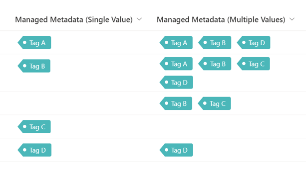

# Display Tags

## Podsumowanie
Ta próbka pokazuje changing managed metadata values to tag-like appearance.

## Wymagania widoku
Ten format można zastosować do a Managed Metadata column. Or it can be applied to a Choice Column too.

## Przykład

Rozwiązanie|Autor(zy)
--------|---------
managed-metadata-tag.json | [Tetsuya Kawahara](https://github.com/tecchan1107)
managed-metadata-tag-multiple-values.json | [Tetsuya Kawahara](https://github.com/tecchan1107)

## Historia wersji

Wersja |Data               |Uwagi
--------|-------------------|--------
1.0     |September 17, 2023 |Wersja początkowa

## Zastrzeżenie
**TEN KOD JEST DOSTARCZANY W STANIE *TAKIM, W JAKIM JEST*, BEZ JAKIEJKOLWIEK GWARANCJI, WYRAŹNEJ ANI DOROZUMIANEJ, W TYM TAKŻE DOROZUMIANYCH GWARANCJI PRZYDATNOŚCI DO OKREŚLONEGO CELU, WARTOŚCI HANDLOWEJ ANI NIENARUSZANIA PRAW.**

