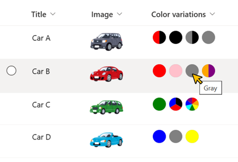
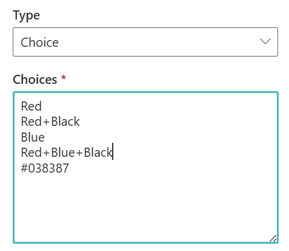

# Color Circles

## Podsumowanie
Ta próbka pokazuje displaying circles of the color of the values of the choices. The circles are shown using SVG to display two-tone colors and various color schemes.

The value of the choices must be set to the HTML color code or HTML color name. (e.g. Red, #038387) Also, to set a two-tone or higher color scheme, a `+` must be set between colors. (e.g. Orange+Purple, Blue+Green+Gray)

## Wymagania widoku
- Ten format można zastosować do a Multi-Select Choice column

## Przykład

Rozwiązanie|Autor(zy)
--------|---------
multi-choice-color-circles.json | [Tetsuya Kawahara](https://github.com/tecchan1107)

## Historia wersji

Wersja |Data          |Uwagi
--------|--------------|--------
1.0     |lipca 17, 2023 |Wersja początkowa

## Zastrzeżenie
**TEN KOD JEST DOSTARCZANY W STANIE *TAKIM, W JAKIM JEST*, BEZ JAKIEJKOLWIEK GWARANCJI, WYRAŹNEJ ANI DOROZUMIANEJ, W TYM TAKŻE DOROZUMIANYCH GWARANCJI PRZYDATNOŚCI DO OKREŚLONEGO CELU, WARTOŚCI HANDLOWEJ ANI NIENARUSZANIA PRAW.**

