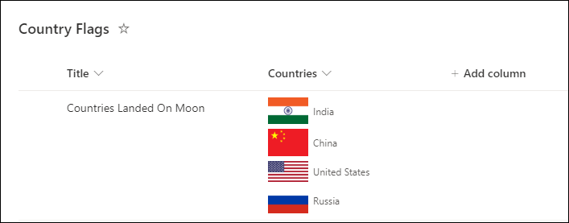
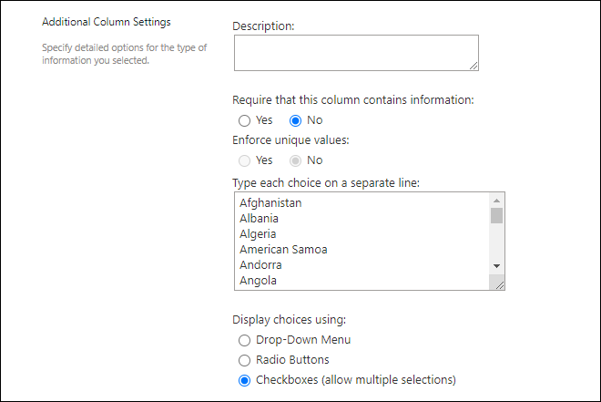

# Multiple Choice Country Flags

## Podsumowanie

Ta próbka pokazuje displaying flags of the counties selected in the multiple selection SharePoint choice column.

The country flags are shown using the [FlagCDN - CDN & API of flags](https://flagcdn.com/) web site API. So, allow `flagcdn.com` domain in HTML Field Security settings of your SharePoint site by following this Microsoft official documentation: [Allow or restrict the ability to embed content on SharePoint pages](https://support.microsoft.com/en-us/office/allow-or-restrict-the-ability-to-embed-content-on-sharepoint-pages-e7baf83f-09d0-4bd1-9058-4aa483ee137b).

Możesz znaleźć the list of countries used in this JSON sample at: [Countries](./assets/countries.xlsx)

Add list of countries in the choice column settings like:

## Wymagania widoku

- Ten format można zastosować do a multiple selection choice column

## Przykład

Rozwiązanie|Autor(zy)
--------|---------
multi-choice-country-flags.json | [Ganesh Sanap](https://github.com/ganesh-sanap)

## Historia wersji

Wersja |Data          |Uwagi
--------|--------------|--------
1.0     |sierpnia 27, 2023 |Wersja początkowa

## Zastrzeżenie
**TEN KOD JEST DOSTARCZANY W STANIE *TAKIM, W JAKIM JEST*, BEZ JAKIEJKOLWIEK GWARANCJI, WYRAŹNEJ ANI DOROZUMIANEJ, W TYM TAKŻE DOROZUMIANYCH GWARANCJI PRZYDATNOŚCI DO OKREŚLONEGO CELU, WARTOŚCI HANDLOWEJ ANI NIENARUSZANIA PRAW.**

