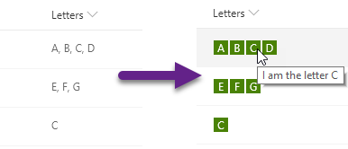

# Multi-Choice forEach

## Podsumowanie
Ta próbka pokazuje usage of the `forEach` property to create template elements applied to each choice in a multi-select choice field.

## Wymagania widoku
- Ten format można zastosować do a Multi-Select Choice column
- This format uses operators only available in SharePoint Online and cannot be used in SharePoint 2019

## Przykład

Rozwiązanie|Autor(zy)
--------|---------
multi-choice-foreach.json | [Chris Kent](https://github.com/thechriskent)

## Historia wersji

Wersja|Data|Uwagi
-------|----|--------
1.0|April 4, 2019|Wersja początkowa

## Zastrzeżenie
**TEN KOD JEST DOSTARCZANY W STANIE *TAKIM, W JAKIM JEST*, BEZ JAKIEJKOLWIEK GWARANCJI, WYRAŹNEJ ANI DOROZUMIANEJ, W TYM TAKŻE DOROZUMIANYCH GWARANCJI PRZYDATNOŚCI DO OKREŚLONEGO CELU, WARTOŚCI HANDLOWEJ ANI NIENARUSZANIA PRAW.**

---

## Dodatkowe uwagi

- [Użyj formatowania kolumn do dostosowania SharePoint](https://docs.microsoft.com/en-us/sharepoint/dev/declarative-customization/column-formatting)

- For a more elaborate usage of `forEach` check out the [multi-person-facepile](../multi-person-facepile) sample.

