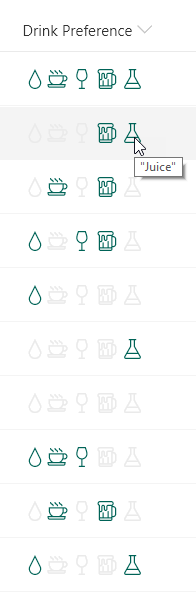

# Multi-Choice Icons

## Podsumowanie
Ta próbka pokazuje using the `indexOf` and `join` functions (O365 only) to test if a multi-select choice field has a selected choice. Providing icons of the known choices and applying themed colors based on if the given choice is selected or not creates an intuitive, easy to understand visualization that doesn't suffer from varying item order or text formatting issues.

Ta próbka pokazuje również, jak używać podwójnych cudzysłowów wewnątrz wartości. Aby je dodać, musisz je poprzedzić znakiem ucieczki zgodnie ze składnią JSON, umieszczając ukośnik przed cudzysłowem: `"\"Juice\""`

The `indexOf` function returns the index where a given value is found within a string (indexes start at 0). If the value is not found in the text, the result is -1.

To evaluate if text contains a given value, we want to know if the index of the value within the string is anything but -1. So we can use the function like this:

`"=if(indexOf(@currentField,'dog') != -1, 'Yes', 'No')"`

Some example values and the result using the function above:
`@currentField`|result
---|---
A dog | Yes
a Dog | No
dog's are nice | Yes
bark dog bark | Yes

Notice that the `indexOf` function is **case-sensitive**. You can do a case-insensitive check by adding the `toLowerCase` function like this:

`"=if(indexOf(toLowerCase(@currentField),'dog') != -1, 'Yes', 'No')"`

When it comes to an array of values (such as a multi-select choice or person column) we can't use `indexOf` directly because it expects a string value. Using it directly on multi-select fields will always result in -1.

We can use the `join` or `toString` functions on the value first and then nest those within the `indexOf` call:

`"=if(indexOf(join(@currentField,''),'dog') != -1, 'Yes', 'No')`

## Wymagania widoku
- Ten format można zastosować do a Multi-Select Choice column
- This format uses operators only available in SharePoint Online and cannot be used in SharePoint 2019

### Przykład Choice Values
- Water
- Coffee
- Wine
- Beer
- "Juice"

## Przykład

Rozwiązanie|Autor(zy)
--------|---------
multi-choice-icons.json | [Chris Kent](https://github.com/thechriskent)

## Historia wersji

Wersja|Data|Uwagi
-------|----|--------
1.0|February 5, 2019|Wersja początkowa

## Zastrzeżenie
**TEN KOD JEST DOSTARCZANY W STANIE *TAKIM, W JAKIM JEST*, BEZ JAKIEJKOLWIEK GWARANCJI, WYRAŹNEJ ANI DOROZUMIANEJ, W TYM TAKŻE DOROZUMIANYCH GWARANCJI PRZYDATNOŚCI DO OKREŚLONEGO CELU, WARTOŚCI HANDLOWEJ ANI NIENARUSZANIA PRAW.**

---

## Dodatkowe uwagi
- [Użyj formatowania kolumn do dostosowania SharePoint](https://docs.microsoft.com/en-us/sharepoint/dev/declarative-customization/column-formatting)

The `indexOf` and `join` functions are not available in SharePoint 2019

