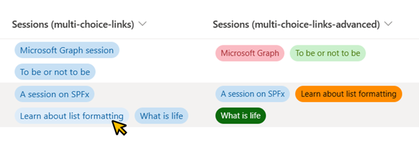
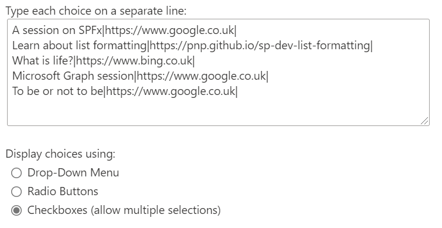
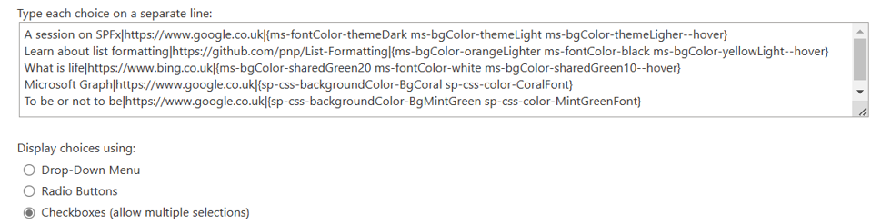

# Multi-Choice Links

## Podsumowanie
Ta próbka pokazuje how we can display multiple links in a single column using the multi-choice column.

**Note:** If rich text column is used to display links then this sample can be ignored. 



## Wymagania widoku
Próbka expects the choices in the `Sessions` column to use the format `<Link Title>|<The actual link>|`.

For Example - if the link we want to display has the title `Learn about list formatting` and the actual link is `https://pnp.github.io/sp-dev-list-formatting` then the choice for that in the `Sessions` column should be `Learn about list formatting|https://pnp.github.io/sp-dev-list-formatting|`.

Session column's choice values used in the example screenshot above:



### Advanced Format

Also included is an additional format (multi-choice-links-advanced.json) that sets the background and text colors for each link. This sample format expects the choices to be in the format `<Link Title>|<The actual link>|{Predefined classes}`.



## Details of the sample

To display the links, we loop through the values present in the multi-choice column of the current item and extract the `<Link title>` using this formula:
```JSON
"=substring([$choiceIterator], 0, indexOf([$choiceIterator], '|'))"
```

We then extract `<the actual link>` using this formula:
```JSON
"=substring([$choiceIterator], indexOf([$choiceIterator], '|') + 1,  lastIndexOf([$choiceIterator], '|'))"
```

## Przykład

Rozwiązanie|Autor(zy)
--------|---------
multi-choice-links.json | [Anoop Tatti](https://github.com/anoopt)
multi-choice-links-advanced.json | [Abhijeet Jadhav](https://github.com/TekExpo)

## Historia wersji

Wersja|Data|Uwagi
-------|----|--------
1.0|April 14, 2021 |Wersja początkowa
1.1|March 17, 2023 |Dodano multi-choice-links-advanced.json

## Zastrzeżenie
**TEN KOD JEST DOSTARCZANY W STANIE *TAKIM, W JAKIM JEST*, BEZ JAKIEJKOLWIEK GWARANCJI, WYRAŹNEJ ANI DOROZUMIANEJ, W TYM TAKŻE DOROZUMIANYCH GWARANCJI PRZYDATNOŚCI DO OKREŚLONEGO CELU, WARTOŚCI HANDLOWEJ ANI NIENARUSZANIA PRAW.**

---


