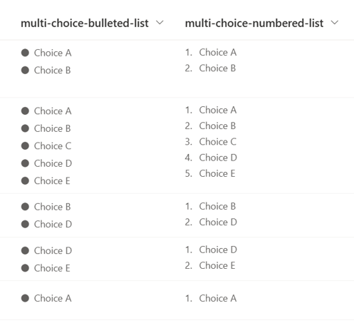
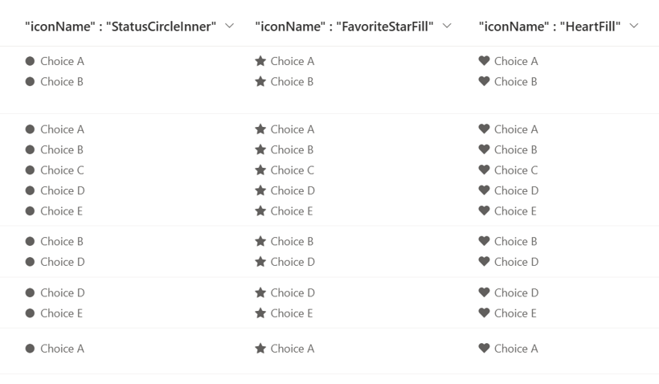

# Bulleted and Numbered List

## Podsumowanie
Ta próbka pokazuje displaying Multi-Select Choice column values like a bulleted and numbered list.

The bullet list symbols use [Fluent UI Icons](https://developer.microsoft.com/en-us/fluentui#/styles/web/icons), which can be changed to stars, hearts, etc. by changing the value of the `iconName` property.

## Wymagania widoku
Ten format można zastosować do a Multi-Select Choice column.

## Przykład

Rozwiązanie|Autor(zy)
--------|---------
multi-choice-list.json | [Tetsuya Kawahara](https://github.com/tecchan1107)
multi-choice-numbered-list.json | [Tetsuya Kawahara](https://github.com/tecchan1107)

## Historia wersji

Wersja |Data             |Uwagi
--------|-----------------|----------------
1.0     |stycznia 14, 2023 |Wersja początkowa

## Zastrzeżenie
**TEN KOD JEST DOSTARCZANY W STANIE *TAKIM, W JAKIM JEST*, BEZ JAKIEJKOLWIEK GWARANCJI, WYRAŹNEJ ANI DOROZUMIANEJ, W TYM TAKŻE DOROZUMIANYCH GWARANCJI PRZYDATNOŚCI DO OKREŚLONEGO CELU, WARTOŚCI HANDLOWEJ ANI NIENARUSZANIA PRAW.**

