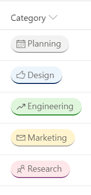

# Work Progress Category Pill

## Podsumowanie

This JSON sample demonstrates how you can format the work progress category choices as pills found in the newly released Microsoft Lists Work progress tracker template.

## Wymagania widoku

* The `multi-choice-workcategory-pill.json` format can be applied to any multiple selection choice column, while the `text-column-workcategory-pill.json` format can be applied to other columns. Both formats expect the column values to be one of the following choices:
  + Planning
  + Design
  + Engineering
  + Marketing
  + Research

## Przykład

Rozwiązanie|Autor(zy)
--------|---------
multi-choice-workcategory-pill.json | [Ganesh Sanap](https://github.com/ganesh-sanap)
text-column-workcategory-pill.json | [Ganesh Sanap](https://github.com/ganesh-sanap) & [Tetsuya Kawahara](https://github.com/tecchan1107)

## Historia wersji

| Version | Date          | Comments        |
|---------|---------------|-----------------|
| 1.0     | August 08, 2020 | Wersja początkowa |
| 1.1     | November 1, 2024 | Dodano text-column-workcategory-pill.json |
| 1.2     | November 15, 2024 | Modified text-column-workcategory-pill.json to change colors and icons based on field values |

## Zastrzeżenie

**TEN KOD JEST DOSTARCZANY W STANIE *TAKIM, W JAKIM JEST*, BEZ JAKIEJKOLWIEK GWARANCJI, WYRAŹNEJ ANI DOROZUMIANEJ, W TYM TAKŻE DOROZUMIANYCH GWARANCJI PRZYDATNOŚCI DO OKREŚLONEGO CELU, WARTOŚCI HANDLOWEJ ANI NIENARUSZANIA PRAW.**

---

## Dodatkowe uwagi

Ta próbka wykorzystuje some predefined classes also covered in the official documentation of Column Formatting:

- [Use column formatting to customize SharePoint - Style guidelines](https://docs.microsoft.com/en-us/sharepoint/dev/declarative-customization/column-formatting#style-guidelines)

