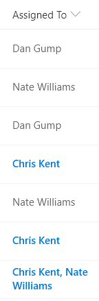

# Highlight the Current User (Using a Multi-Person Column)

## Podsumowanie
Ta próbka wykorzystuje the `@me` keyword to check if the person field contains the current user and shows that entry using a different color and weight. This is a dynamic check that will always highlight the user using the list (not the creater of the format). This template could easily be extended to apply different/additional styles or icons as desired by simply copying the same expression logic for other fields.

> Note - The entry set of users will be formatted (not just the current user's name)

The [Office UI Fabric](https://developer.microsoft.com/en-us/fabric) theme color classes and a font weight class are used to ensure the format looks good across themes (including custom themes).

## Wymagania widoku
- Ten format można zastosować do a Person column
- This format uses operators only available in SharePoint Online and cannot be used in SharePoint 2019

## Przykład

Rozwiązanie|Autor(zy)
--------|---------
multi-person-currentuser.json | [Chris Kent](https://github.com/thechriskent)

## Historia wersji

Wersja|Data|Uwagi
-------|----|--------
1.0|February 5, 2019|Wersja początkowa

## Zastrzeżenie
**TEN KOD JEST DOSTARCZANY W STANIE *TAKIM, W JAKIM JEST*, BEZ JAKIEJKOLWIEK GWARANCJI, WYRAŹNEJ ANI DOROZUMIANEJ, W TYM TAKŻE DOROZUMIANYCH GWARANCJI PRZYDATNOŚCI DO OKREŚLONEGO CELU, WARTOŚCI HANDLOWEJ ANI NIENARUSZANIA PRAW.**

---

## Dodatkowe uwagi

- [Użyj formatowania kolumn do dostosowania SharePoint](https://docs.microsoft.com/en-us/sharepoint/dev/declarative-customization/column-formatting#me)

Ta próbka działa **zarówno** dla pól osoby jednokrotnego, jak i wielokrotnego wyboru. Dodatkowo dostępna jest osobna próbka przeznaczona dla pól osoby jednokrotnego wyboru: [person-currentuser-rowclass](../person-currentuser). To prostszy przykład pokazujący, jak używać operatora `@me`.

