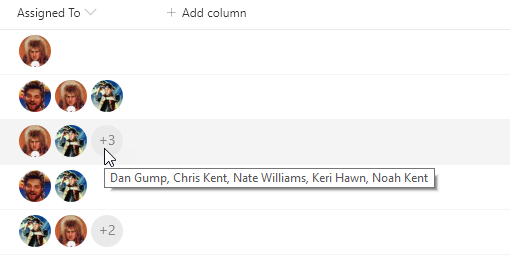

# Multi-Person Facepile

## Podsumowanie
Ta próbka przedstawia rounded images for each person in a multi-select person field.

Próbka demonstrates the use of the `forEach` property to apply a format for each value of an array (multi-select person fields). Additionally, the `loopIndex` operator is used in conjunction with the `length` operator to ensure that regardless of how many persons are selected the field doesn't run over. This style of profile pictures with a descriptive overflow is often called a [facepile](https://developer.microsoft.com/en-us/fabric#/components/facepile)

### Rozmiary obrazów profilowych użytkownika

|Key|Size|
|:---:|:---:|
|S|48x48|
|M|72x72|
|L|300x?*|

The L size profile pictures maintain the ratio of the original photo which means they are not guaranteed to be square. Neither are they guaranteed to be 300px wide. The maximum width will be 300px but if the original image was smaller than that, then it will be the original size. Even the placeholder image for the L size is only 250x150.

Overall, however, the L size shouldn't be used inside columns not only because the ratio is not guaranteed, but because the default column width won't allow you to take up that much space.

> Uwaga: `@currentField.picture` może zostać użyte do pobrania zdjęcia profilowego bezpośrednio z kolumny osoby. W tym podejściu opcje rozmiaru nie są jednak dostępne.

## Wymagania widoku
- Ten format można zastosować do a Multi-Select Person column
- Ten format używa operatorów dostępnych wyłącznie w SharePoint Online i nie może być używany w SharePoint 2019

## Przykład

Rozwiązanie|Autor(zy)
--------|---------
multi-person-facepile.json | [Chris Kent](https://github.com/thechriskent)

## Historia wersji

Wersja|Data|Uwagi
-------|----|--------
1.0|4 kwietnia 2019|Wersja początkowa
1.1|22 stycznia 2020|Dodano vertical-align property for use in Microsoft Teams

## Zastrzeżenie
**TEN KOD JEST DOSTARCZANY W STANIE *TAKIM, W JAKIM JEST*, BEZ JAKIEJKOLWIEK GWARANCJI, WYRAŹNEJ ANI DOROZUMIANEJ, W TYM TAKŻE DOROZUMIANYCH GWARANCJI PRZYDATNOŚCI DO OKREŚLONEGO CELU, WARTOŚCI HANDLOWEJ ANI NIENARUSZANIA PRAW.**

---

## Dodatkowe uwagi

- [Użyj formatowania kolumn do dostosowania SharePoint](https://docs.microsoft.com/en-us/sharepoint/dev/declarative-customization/column-formatting)

- A format geared toward providing a rounded image for single person fields can be found here: [person-roundimage-format](../person-roundimage-format)

