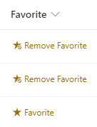

# Multi Person Favorite

## Podsumowanie
Ta próbka pokazuje the use of the "setValue" and "customRowAction" to let a user add a list item as a favorite in a multi-person column.

> [!NOTE]  
> INTERNALCOLUMNNAME in the code must be re-named to the internal column name.

## Wymagania widoku

- Ten format można zastosować do a Multi-Person Column
- To get most out of the formatting, create a new view filtered on the 'Favorite' column to [@me]

## Przykład

Rozwiązanie|Autor(zy)
--------|---------
multi-person-favorite.json | [Alexander Henkel](https://github.com/AlexanderHenkel)

## Historia wersji

Wersja |Data         |Uwagi
--------|-------------|--------
1.0     |July 31, 2023 |Wersja początkowa

## Dodatkowe uwagi

Próbka is based on [Assign To Me](https://github.com/pnp/List-Formatting/tree/master/column-samples/person-assign-to-me) example by [Tetsuya Kawahara](https://github.com/tecchan1107)

## Zastrzeżenie

**THIS CODE IS PROVIDED AS IS WITHOUT WARRANTY OF ANY KIND, EITHER EXPRESS OR IMPLIED, INCLUDING ANY IMPLIED WARRANTIES OF FITNESS FOR A PARTICULAR PURPOSE, MERCHANTABILITY, OR NON-INFRINGEMENT.**

