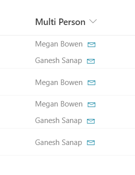

# Multi-Person Mail To Link

## Podsumowanie

Ta próbka formatowania kolumn demonstrates how to add a `mailto:` link for each person in a multiple selection person column.

Ta próbka pochodzi z [person-mailto](https://github.com/pnp/List-Formatting/tree/master/column-samples/person-mailto).

## Wymagania widoku

Ten format powinien być zastosowany do a multiple selection person column.

## Przykład

Rozwiązanie|Autor(zy)
--------|---------
multi-person-mailto.json | [Ganesh Sanap](https://github.com/ganesh-sanap)

## Historia wersji

Wersja |Data          |Uwagi
--------|--------------|--------------------------------
1.0     |December 12, 2021 |Wersja początkowa

## Zastrzeżenie

**TEN KOD JEST DOSTARCZANY W STANIE *TAKIM, W JAKIM JEST*, BEZ JAKIEJKOLWIEK GWARANCJI, WYRAŹNEJ ANI DOROZUMIANEJ, W TYM TAKŻE DOROZUMIANYCH GWARANCJI PRZYDATNOŚCI DO OKREŚLONEGO CELU, WARTOŚCI HANDLOWEJ ANI NIENARUSZANIA PRAW.**

