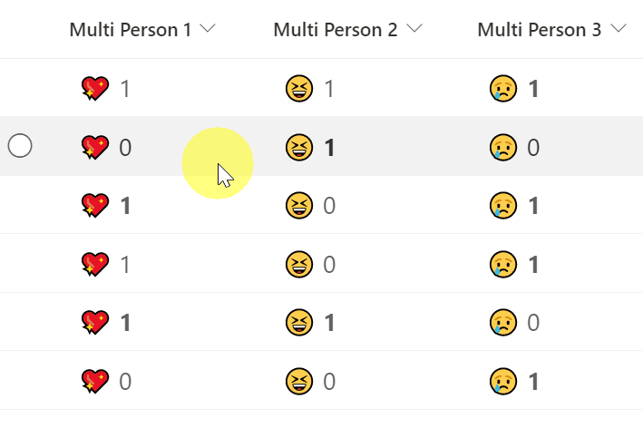

# Reacting and displaying users who have reacted

## Podsumowanie
Ta próbka pokazuje how to react and display users who have reacted. If the current user reacts, the number will be bolded. Also, this sample uses the `setValue` of `customRowAction` to update the field. Musisz set the `actionInput` to the internal name of the column to be updated.

## Wymagania widoku
Ten format można zastosować do a Multi-Select Person column.

## Przykład

Rozwiązanie|Autor(zy)
--------|---------
multi-person-reaction.json | [Tetsuya Kawahara](https://github.com/tecchan1107)

## Historia wersji

Wersja |Data              |Uwagi
--------|------------------|--------
1.0     |listopada 21, 2021 |Wersja początkowa

## Zastrzeżenie
**TEN KOD JEST DOSTARCZANY W STANIE *TAKIM, W JAKIM JEST*, BEZ JAKIEJKOLWIEK GWARANCJI, WYRAŹNEJ ANI DOROZUMIANEJ, W TYM TAKŻE DOROZUMIANYCH GWARANCJI PRZYDATNOŚCI DO OKREŚLONEGO CELU, WARTOŚCI HANDLOWEJ ANI NIENARUSZANIA PRAW.**

