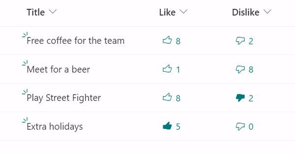

# Like / Dislike - Unique reaction

## Podsumowanie
Ta próbka pokazuje the usage of the `setValue` action and array manipulation using `removeFrom` and `appendTo` on multiple fields at the same time, by creating buttons to like/dislike an item and updating two multi person fields, one used to save the likes (people who liked), the other one to save the dislikes (people who disliked).

A user can only either like or dislike an item, if an item is liked by the current and is disliked, the like is undone and vice-versa (similar to what happens in YouTube).

## Wymagania widoku

|Type|Internal Name|Required|Additional Information
|---|---|:---:|---|
|Person or Group (Multi)|Like|Yes| Apply the template [multi-person-unique-reaction.json](./multi-person-unique-reaction.json) on this field
|Person or Group (Multi)|Dislike|Yes| Apply the template [multi-person-unique-reaction-dislike.json](./multi-person-unique-reaction-dislike.json) on this field

## Przykład

Rozwiązanie|Autor(zy)
--------|---------
multi-person-unique-reaction.json | [Michel Mendes](https://github.com/michelcarlo)
multi-person-unique-reaction-dislike.json | [Michel Mendes](https://github.com/michelcarlo)

## Historia wersji

Wersja |Data          |Uwagi
--------|--------------|--------------------------------
1.0     |November 27, 2021 |Wersja początkowa

## Zastrzeżenie
**TEN KOD JEST DOSTARCZANY W STANIE *TAKIM, W JAKIM JEST*, BEZ JAKIEJKOLWIEK GWARANCJI, WYRAŹNEJ ANI DOROZUMIANEJ, W TYM TAKŻE DOROZUMIANYCH GWARANCJI PRZYDATNOŚCI DO OKREŚLONEGO CELU, WARTOŚCI HANDLOWEJ ANI NIENARUSZANIA PRAW.**
##

