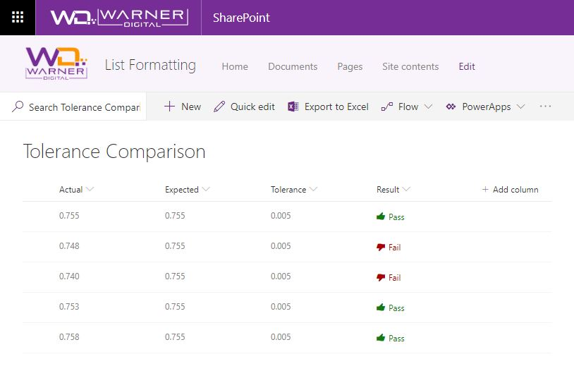

# Tolerance Comparison

## Podsumowanie

Display if a value is within the expected tolerance.

To determine success, the column formatting definition subtracts the "Actual" value from the "Expected" value and applies the "abs()" operator to retrieve the absolute value. The result is compared to the "Tolerance" column value to determine pass or fail.

A Fluent UI icon is also applied to provide visual indicators of Pass or Fail.

### Screenshot

## Column Types
The columns used in this sample were created as "Liczba" column types.

## Wymagania widoku
- Ten format używa operatorów dostępnych wyłącznie w SharePoint Online i nie może być używany w SharePoint 2019

## Przykład

Rozwiązanie|Autor(zy)
--------|---------
number-abs-tolerance-comparison.json | [David Warner II](https://github.com/PopWarner)

## Historia wersji

Wersja|Data|Uwagi
-------|----|--------
1.0|8 marca 2019|Wersja początkowa

## Zastrzeżenie
**TEN KOD JEST DOSTARCZANY W STANIE *TAKIM, W JAKIM JEST*, BEZ JAKIEJKOLWIEK GWARANCJI, WYRAŹNEJ ANI DOROZUMIANEJ, W TYM TAKŻE DOROZUMIANYCH GWARANCJI PRZYDATNOŚCI DO OKREŚLONEGO CELU, WARTOŚCI HANDLOWEJ ANI NIENARUSZANIA PRAW.**

---

## Dodatkowe uwagi

- [Użyj formatowania kolumn do dostosowania SharePoint](https://docs.microsoft.com/en-us/sharepoint/dev/declarative-customization/column-formatting)

