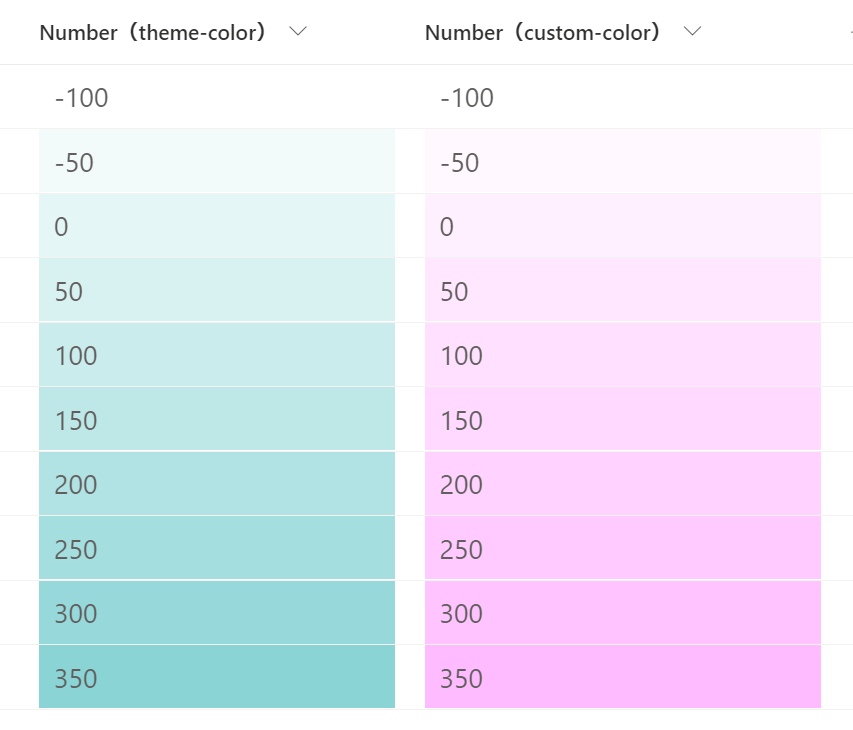

# Shaded Backgrounds

## Podsumowanie
Ta próbka pokazuje how to change the shade of the background color depending on the value of the number column. Also, in this sample, the background color is lightest at `-100` and darkest at `350`.

- `number-background-color-shading.json` uses your site's theme color as the background color.
- `number-background-color-shading-custom-color.json` uses the HTML color code as the background color, and in the sample, `#FFBBFF` is set.

## Wymagania widoku

Ten format można zastosować do a Liczba column.

## Przykład

Rozwiązanie|Autor(zy)
--------|---------
number-background-color-shading.json | [Tetsuya Kawahara](https://github.com/tecchan1107)
number-background-color-shading-custom-color.json | [Tetsuya Kawahara](https://github.com/tecchan1107)

## Historia wersji

Wersja |Data             |Uwagi
--------|-----------------|----------------
1.0     |listopada 16, 2021|Wersja początkowa

## Zastrzeżenie
**TEN KOD JEST DOSTARCZANY W STANIE *TAKIM, W JAKIM JEST*, BEZ JAKIEJKOLWIEK GWARANCJI, WYRAŹNEJ ANI DOROZUMIANEJ, W TYM TAKŻE DOROZUMIANYCH GWARANCJI PRZYDATNOŚCI DO OKREŚLONEGO CELU, WARTOŚCI HANDLOWEJ ANI NIENARUSZANIA PRAW.**

