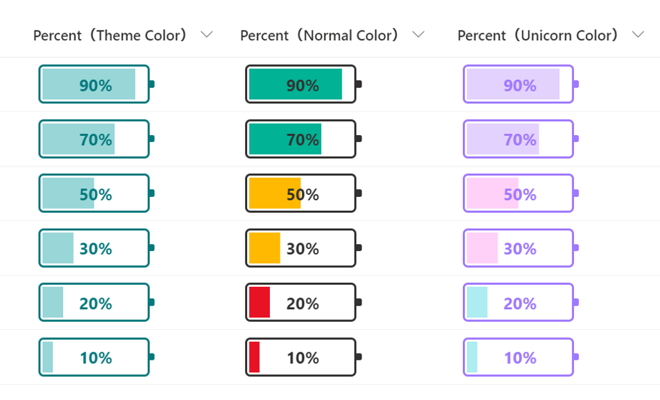

# Liczba Battery

## Podsumowanie
Ta próbka zmienia wygląd wartości w kolumnach liczbowych (procentowych), aby przypominały baterię.

- `number-battery.json` displays a battery of colors for the site's theme color. The background color will not change depending on the value.
- `number-battery-normal-color.json` and `number-battery-unicorn-color.json` are independent of the site theme color. Also, the background color will change depending on the value: greater than 50%, greater than 20%, and greater than 0%.

## Wymagania widoku
Ten format można zastosować do a Liczba column. It is expected that the values will be from 0 to 1 (percent).

## Przykład

Rozwiązanie|Autor(zy)
--------|---------
number-battery.json | [Tetsuya Kawahara](https://github.com/tecchan1107)
number-battery-normal-color.json | [Tetsuya Kawahara](https://github.com/tecchan1107)
number-battery-unicorn-color.json | [Tetsuya Kawahara](https://github.com/tecchan1107)

## Historia wersji

Wersja |Data          |Uwagi
--------|--------------|----------------
1.0     |maja 2, 2021   |Wersja początkowa
1.1     |czerwca 23, 2021 |Dodano 2 samples

## Zastrzeżenie
**TEN KOD JEST DOSTARCZANY W STANIE *TAKIM, W JAKIM JEST*, BEZ JAKIEJKOLWIEK GWARANCJI, WYRAŹNEJ ANI DOROZUMIANEJ, W TYM TAKŻE DOROZUMIANYCH GWARANCJI PRZYDATNOŚCI DO OKREŚLONEGO CELU, WARTOŚCI HANDLOWEJ ANI NIENARUSZANIA PRAW.**

